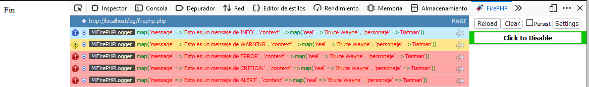

# Herramientas

??? abstract "Duración y criterios de evaluación"

    Duración estimada: 16 sesiones

    <hr />

    | Resultado de aprendizaje  | Criterios de evaluación   |
    | ------                    | -----                     |
    | 4.- Desarrolla aplicaciones Web embebidas en lenguajes de marcas analizando e incorporando funcionalidades según especificaciones.        | g) Se han utilizado herramientas y entornos para facilitar la programación, prueba y depuración del código.   |

En esta unidad vamos a estudiar algunas de las herramientas más utilizadas en PHP.

## 5.1 Composer

<figure style="float: right;">
    
    <figcaption>Logo Composer</figcaption>
</figure>

Herramienta por excelencia en PHP para la **gestión de librerías y dependencias**, de manera que instala y las actualiza asegurando que todo el equipo de desarrollo tiene el mismo entorno y versiones. Además, ofrece *autoloading* de nuestro código, de manera que no tengamos que hacerlo nosotros "a mano".

Está escrito en PHP, y podéis consultar toda su documentación en [https://getcomposer.org/](https://getcomposer.org/).

Utiliza [*Packagist*]( https://packagist.org/) como repositorio de librerías.

Funcionalmente, es similar a Maven (Java) / npm (JS).

### Instalación

Si estamos usando XAMPP, hemos de instalar *Composer* en el propio sistema operativo. Se recomienda seguir las [instrucciones oficiales](https://getcomposer.org/doc/00-intro.md) según el sistema operativo a emplear.

En cambio, si usamos *Docker*, necesitamos modificar la configuración de nuestro contenedor. En nuestro caso, hemos decidido modificar el archivo `Dockerfile` y añadir el siguiente comando:

``` docker
COPY --from=composer:2.0 /usr/bin/composer /usr/local/bin/composer
```

Para facilitar el trabajo, hemos creado una [plantilla ya preparada](recursos/plantilla-APC.zip).

Es importante que dentro del contenedor comprobemos que tenemos la v2:

``` bash
composer -V
```

### Inicializar proyecto

Cuando creemos un proyecto por primera vez, hemos de inicializar el repositorio. Para ello, en el directorio del proyecto ejecutaremos el comando `composer init` donde:

* Configuramos el nombre del paquete, descripción, autor (formato: nombre <email>), tipo de paquete (project), etc...
* Definimos las dependencias del proyecto (`require`) y las de desarrollo (`require-dev`) de manera interactiva.
    * En las de desarrollo se indica aquellas que no se instalarán en el entorno de producción, por ejemplo, las librerías de pruebas.

Tras su configuración, se creará automáticamente el archivo `composer.json` con los datos introducidos y descarga las librerías en la carpeta `vendor`. La instalación de las librerías siempre se realiza de manera local para cada proyecto.

``` json
{
    "name": "dwes/log",
    "description": "Pruebas de Monolog",
    "type": "project",
    "require": {
        "monolog/monolog": "^3.7"
    },
    "license": "MIT",
    "authors": [
        {
            "name": "Eladio Blanco",
            "email": "eladio.blanco@fernando3martos.com"
        }
    ]
}

```

A la hora de indicar cada librería introduciremos:

* el nombre de la librería, compuesta tanto por el creador o "vendor", como por el nombre del proyecto. Ejemplos: `monolog/monolog` o `laravel/installer`.
* la versión de cada librería. Tenemos diversas opciones para indicarla:

    * Directamente: 1.4.2
    * Con comodines: 1.*
    * A partir de: >= 2.0.3
    * Sin rotura de cambios: ^1.3.2 // >=1.3.2 <2.0.0

### Actualizar librerías

Podemos definir las dependencias via el archivo `composer.json` o mediante comandos con el formato `composer require vendor/package:version`. Por ejemplo, si queremos añadir phpUnit como librería de desarrollo, haremos:

``` bash
composer require phpunit/phpunit –dev
```

Tras añadir nuevas librerías, hemos de actualizar nuestro proyecto:

``` bash
composer update
```

Si creamos el archivo `composer.json` nosotros directamente sin inicializar el repositorio, hemos de instalar las dependencias:

``` bash
composer install
```

Al hacer este paso (tanto instalar como actualizar), como ya hemos comentado, se descargan las librerías en dentro de la carpeta `vendor`. Es muy importante añadir esta carpeta al archivo `.gitignore` para no subirlas a GitHub.

Además se crea el archivo `composer.lock`, que almacena la versión exacta que se ha instalado de cada librería (este archivo no se toca).

### `autoload.php`

*Composer* crea de forma automática en `vendor/autoload.php` el código para incluir de forma automática todas las librerías que tengamos configuradas en `composer.json`.

Para utilizarlo, en la cabecera de nuestro archivos pondremos:

``` php
<?php
require 'vendor/autoload.php';
```

En nuestro caso, de momento sólo lo podremos en los archivos donde probamos las clases

Si queremos que Composer también se encargue de cargar de forma automática nuestras clases de dominio, dentro del archivo `composer.json`, definiremos la propiedad `autoload`:

``` json
"autoload": {
    "psr-4": {"Dwes\\": "app/"}
},
```

PSR-4 es una especificación para la auto carga de clases desde la ruta de los archivos. En el ejemplo anterior se indica el namespace de nuestra aplicación y el directorio dónde serán alojadas las clases. Así, para usar los namespaces dentro de nuestros archivos php basta con referenciarlos de la siguiente forma: `use Dwes\Clase;`.

Posteriormente, hemos de volver a generar el *autoload* de *Composer* mediante la opción `dump-autoload` (o `du`):

``` bash
composer dump-autoload
```

## 5.2 Resend

Vamos a probar *Composer* añadiendo la librería de [*Resend*](https://resend.com/docs/send-with-php) a nuestro proyecto. Se trata de una **API para enviar correos electrónicos** en multitud de lenguajes.

Para ello, incluiremos la librería en nuestro proyecto y actualizamos:

``` bash
composer require resend/resend-php
composer update
```

!!! info "Prerrequisitos: Crear API key y verificar dominio"
    Es importante seguir estas [instrucciones](https://resend.com/docs/send-with-php) previas para crear la **API key** propia que utilizaremos en el proyecto y opcionalmente **verificar el dominio** si queremos enviar correos con nuestra dirección de correo como remitente.

Y una vez tengamos la API key, con este código de prueba enviaríamos un correo:

``` php
<?php

require_once __DIR__ . '/vendor/autoload.php';

$resend = Resend::client('NUESTRA API KEY');

$resend->emails->send([
  'from' => 'Eladio Dev <onboarding@resend.dev>', // No tocar este correo si no tenemos el domino verificado
  'to' => ['eladio.blanco@fernando3martos.com'],
  'subject' => 'Envío desde Resend',
  'html' => '<strong>Funciona!</strong>',
]);
```

### Alternativas

Otras alternativas para el envío de correos electrónicos son:
* Utilizar directamente la función `mail()` de PHP (necesario servidor SMTP configurado).
* Usar la librería [PHPMailer](https://github.com/PHPMailer/PHPMailer) para enviar correos desde servidor SMTP propio o externo como Gmail.
* Para pruebas, usar herramientas como [Mailtrap](https://mailtrap.io/), que permite interceptar los correos para ver cómo se verían en la bandeja de entrada sin enviarlos de verdad. 
* ...

## 5.3 Monolog

De nuevo, mediante *Composer* toca añadir la librería [*Monolog*](https://github.com/Seldaek/monolog) a nuestro proyecto. Se trata de un **librería para la gestión de logs** de nuestras aplicaciones, soportando diferentes niveles (info, warning, etc...), salidas (ficheros, sockets, BBDD, Web Services, email, etc) y formatos (texto plano, HTML, JSON, etc...).

Para ello, incluiremos la librería en nuestro proyecto y actualizamos:

``` bash
composer require monolog/monolog
composer update
```

Monolog 2 requiere al menos PHP 7.2, cumple con el estandar de logging PSR-3, y es la librería empleada por *Laravel* y *Symfony* para la gestión de logs.

!!! info "Cuando usar un log"
    * Seguir las acciones/movimientos de los usuarios
    * Registrar las transacciones
    * Rastrear los errores de usuario
    * Fallos/avisos a nivel de sistema
    * Interpretar y coleccionar datos para posterior investigación de patrones

### Niveles

A continuación mostramos los diferentes niveles de menos a más restrictivo:

* *debug -100*: Información detallada con propósitos de debug. No usar en entornos de producción.
* *info - 200*: Eventos interesantes como el inicio de sesión de usuarios.
* *notice - 250*: Eventos normales pero significativos.
* *warning - 300*: Ocurrencias excepcionales que no llegan a ser error.
* *error - 400*: Errores de ejecución que permiten continuar con la ejecución de la aplicación pero que deben ser monitorizados.
* *critical - 500*: Situaciones importantes donde se generan excepciones no esperadas o no hay disponible un componente.
* *alert - 550*: Se deben tomar medidas inmediatamente.
Caída completa de la web, base de datos no disponible, etc... Además, se suelen enviar mensajes por email.
* *emergency - 600*: Es el error más grave e indica que todo el sistema está inutilizable.

### Prueba Monolog

Por ejemplo, en el archivo `pruebaLog.php` que colocaríamos en la raíz, primero incluimos el *autoload*, importamos las clases a utilizar para finalmente usar los métodos de *Monolog* y consultar la salida de los logs en el archivo `logs/milog.log` que se crea automáticamente:

``` php
<?php
include __DIR__ ."/vendor/autoload.php";

use Monolog\Logger;
use Monolog\Level;
use Monolog\Handler\StreamHandler;

$log = new Logger("MiLogger");
$log->pushHandler(new StreamHandler("logs/milog.log", Level::Debug));

$log->debug("Esto es un mensaje de DEBUG");
$log->info("Esto es un mensaje de INFO");
$log->warning("Esto es un mensaje de WARNING");
$log->error("Esto es un mensaje de ERROR");
$log->critical("Esto es un mensaje de CRITICAL");
$log->alert("Esto es un mensaje de ALERT");
```

En todos los métodos de registro de mensajes (`debug`, `info`, ...), además del propio mensaje, le podemos pasar información como el contenido de alguna variable, usuario de la aplicación, etc.. como segundo parámetro dentro de un array, el cual se conoce como **array de contexto**. Es conveniente hacerlo mediante un array asociativo para facilitar la lectura del log.

``` php
<?php
$log->warning("Producto no encontrado", [$producto]);
$log->warning("Producto no encontrado", ["datos" => $producto]);
```

### Funcionamiento

Cada instancia `Logger` tiene un nombre de canal (MiLogger en el ejemplo anterior) y una pila de manejadores (*handler*).
Cada mensaje que mandamos al log atraviesa la pila de manejadores, y cada uno decide si debe registrar la información, y si se da el caso, finalizar la propagación.
Por ejemplo, un `StreamHandler` en el fondo de la pila que lo escriba todo en disco, y en el tope añade un `MailHandler` que envíe un mail sólo cuando haya un error.

### Manejadores

Cada manejador tambien tiene un formateador (`Formatter`). Si no se indica ninguno, se le asigna uno por defecto. El último manejador insertado será el primero en ejecutarse.
Luego se *van ejecutando* conforme a la pila.

Los manejadores más utilizados son:

* `StreamHandler(ruta, nivel)`: Escribe los logs en un "stream" (flujo) específico, como un archivo en el sistema de archivos o la salida estándar (php://stdout) o la de error (php://stderr).
* `RotatingFileHandler(ruta, maxFiles, nivel)`: Guarda los registros en archivos que se rotan automáticamente según un intervalo de tiempo, por ejemplo, diario.
* `NativeMailerHandler(para, asunto, desde, nivel)`: Envía los mensajes de log a una dirección de correo electrónico usando la función mail() de PHP (necesario servidor SMTP configurado).
* `FirePHPHandler(nivel)`: Envía los logs a la consola de FirePHP (extensión del navegador) a través de las cabeceras HTTP que intercepta. Útil para desarrollo.

Si queremos que los mensajes de la aplicación salgan por el log del servidor, 
en nuestro caso el archivo `error.log` de *Apache* utilizaremos como ruta la salida de error:

``` php
<?php
// error.log
$log->pushHandler(new StreamHandler("php://stderr", Level::Debug));
```

!!! tip "FirePHP"
    Por ejemplo, mediante `FirePHPHandler`, podemos utilizar [FirePHP](https://chromewebstore.google.com/detail/firephp-official/ikfbpappjhegehjflebknjbhdocbgkdi), la cual es una herramienta para hacer debug en la consola de *Firefox* o *Chrome*.
    Tras instalar la extensión en Firefox, habilitar las opciones y configurar el *Handler*, podemos ver los mensajes coloreados con sus datos:

    ``` php
    <?php
    $log = new Logger("MiFirePHPLogger");
    $log->pushHandler(new FirePHPHandler(Level::Info));

    $datos = ["real" => "Bruce Wayne", "personaje" => "Batman"];
    $log->debug("Esto es un mensaje de DEBUG", $datos);
    $log->info("Esto es un mensaje de INFO", $datos);
    $log->warning("Esto es un mensaje de WARNING", $datos);
    // ...
    ```

    <figure style="align: center;">
        
        <figcaption>Ejemplo de uso de FirePHP</figcaption>
    </figure>

### Canales

Se les asigna al crear el `Logger`. En grandes aplicaciones, se crea un canal por cada subsistema para identificar el origen de los logs: ventas, contabilidad, almacén. No es una buena práctica usar el nombre de la clase como canal, esto se hace con un *procesador*.

Es recomendable utilizar el log como una propiedad privada de la clase que nos interese, asignando el canal, manejadores y formato en el propio constructor de la clase.

``` php
<?php
// Propiedad log privada de la clase configurada con el canal 'MiApp'
$this->log = new Logger("MiApp");
$this->log->pushHandler(new StreamHandler("logs/milog.log", Level::Debug));
$this->log->pushHandler(new FirePHPHandler(Level::Debug));
```

Y dentro de los métodos de la clase, para escribir en el log haríamos algo así:

``` php
<?php
$this->log->warning("Producto no encontrado", [$producto]);
```

### Procesadores

Los procesadores son componentes que permiten modificar o agregar información adicional a cada mensaje de log antes de que este sea enviado a su destino final por el handler. Para ello, se apilan después de cada manejador mediante el método `pushProcessor($procesador)`.

Algunos procesadores conocidos son `IntrospectionProcessor` (muestran la linea, fichero, clase y metodo desde el que se invoca el log), `WebProcessor` (añade la URI, método e IP) o `GitProcessor` (añade la rama y el commit).

Se pueden combinar entre sí para mostrar la información de cada uno de ellos en cada log.

=== "PHP"

    ``` php
    <?php
    use Monolog\Logger;
    use Monolog\Level;
    use Monolog\Handler\StreamHandler;
    use Monolog\Handler\FirePHPHandler;
    use Monolog\Processor\IntrospectionProcessor;
    use Monolog\Processor\WebProcessor;

    // Crear logger con canal "MiLogger"
    $log = new Logger("MiLogger");

    // Manejadores de logs
    $log->pushHandler(new StreamHandler("logs/milog.log", Level::Debug));
    $log->pushHandler(new FirePHPHandler(Level::Info));

    // Procesadores para añadir/modificar información de los logs
    $log->pushProcessor(new IntrospectionProcessor());
    $log->pushProcessor(new WebProcessor());

    // Mensaje de log
    $log->debug("Esto es un mensaje de DEBUG");
    ```

=== "Consola en formato texto"

    ``` log
    [2024-11-05T18:59:32.512183+01:00] MiLogger.DEBUG: Esto es un mensaje de DEBUG [] {"url":"/t05/01composer/pruebaLog.php","ip":"192.168.65.1","http_method":"GET","server":"localhost","referrer":"http://localhost/t05/01composer/pruebaLog.php","file":"/var/www/html/t05/01composer/pruebaLog.php","line":19,"class":null,"callType":null,"function":null}
    ```

También es posible añadir un procesador como una función. En el siguiente ejemplo se añade la IP del usuario:

=== "PHP"

    ``` php
    <?php
    // Crear logger con canal "MiLogger"
    $log = new Logger("MiLogger");

    // Manejadores de logs
    $log->pushHandler(new StreamHandler("logs/milog.log", Level::Debug));
    $log->pushHandler(new FirePHPHandler(Level::Info));

    // Procesadores para añadir/modificar información de los logs como función
    $log->pushProcessor(function ($record) {
        $record['extra']['user_ip'] = $_SERVER['REMOTE_ADDR'] ?? 'N/A';
        return $record;
    });

    // Mensaje de log
    $log->debug("Esto es un mensaje de DEBUG");
    ```

=== "Consola en formato texto"

    ``` log
    [2024-11-05T19:06:52.582058+01:00] MiLogger.DEBUG: Esto es un mensaje de DEBUG [] {"user_ip":"192.168.65.1"}
    ```

### Formateadores

Se asocian a los manejadores con `setFormatter`. Los formateadores más utilizados son `LineFormatter`, `HtmlFormatter` o `JsonFormatter`.

=== "PHP"

    ``` php
    <?php
    $log = new Logger("MiLogger");
    $rfh = new RotatingFileHandler("logs/milog.log", Level::Debug);
    $rfh->setFormatter(new JsonFormatter());
    $log->pushHandler($rfh);
    ```

=== "Consola en JSON"

    ``` json
    {"message":"Esto es un mensaje de DEBUG","context":{},"level":100,"level_name":"DEBUG","channel":"MiLogger","datetime":"2020-11-27T15:36:52.747211+01:00","extra":{}}
    {"message":"Esto es un mensaje de INFO","context":{},"level":200,"level_name":"INFO","channel":"MiLogger","datetime":"2020-11-27T15:36:52.747538+01:00","extra":{}}
    ```

!!! tip "Más información"
    Más información sobre manejadores, formateadores y procesadores en <https://github.com/Seldaek/monolog/blob/master/doc/02-handlers-formatters-processors.md>

### Uso de Factorías

En vez de instanciar un log en cada clase, es conveniente crear una factoría (por ejemplo, siguiendo la idea del patrón de diseño [*Factory Method*](https://refactoring.guru/es/design-patterns/factory-method)) encapsulando así la creación del Logger en dicho método. De esta forma se simplifican futuros mantenimientos de código si cambiamos el sistema de logs. Sólo habrá que tocar en este método y no en cada clase que use los logs.

Para el siguiente ejemplo, vamos a suponer que creamos la factoría en el *namespace* `Dwes\Ejemplos\Util`.

``` php
<?php
namespace Dwes\Ejemplos\Util

use Monolog\Logger;
use Monolog\Handler\StreamHandler;

class LogFactory {

    public static function getLogger(string $canal = "miApp") : Logger {
        $log = new Logger($canal);
        $log->pushHandler(new StreamHandler("logs/miApp.log", Level::Debug));

        return $log;
    }
}
```

Si en vez de devolver un `Monolog\Logger` utilizamos el interfaz de PSR, si en el futuro cambiamos la implementación del log, no tendremos que modificar nuestro codigo. Así pues, la factoría ahora devolverá `Psr\Log\LoggerInterface`:

``` php
<?php
namespace Dwes\Ejemplos\Util

use Monolog\Handler\StreamHandler;
use Monolog\Logger;
use Psr\Log\LoggerInterface;

class LogFactory {

    public static function getLogger(string $canal = "miApp") : LoggerInterface {
        $log = new Logger($canal);
        $log->pushHandler(new StreamHandler("log/miApp.log", Level::Debug));

        return $log;
    }
}
```

Finalmente, para utilizar la factoría, sólo cambiamos el código que teníamos en el constructor de las clases que usan el log, quedando algo asi:

``` php
<?php

namespace Dwes\Ejemplos\Model;

use Dwes\Ejemplos\Util\LogFactory;
use Monolog\Logger;

class Cliente {

    private $codigo; 

    private Logger $log;

    function __construct($codigo){ 
        $this->codigo=$codigo; 

        $this->log = LogFactory::getLogger();
    }

    /// ... resto del código
}
```

## 5.4 Documentación con *phpDocumentor*

[phpDocumentor](https://www.phpdoc.org/) es la herramienta *de facto* para documentar el código PHP. Es similar en propósito y funcionamiento a *Javadoc*.

Así pues, es un herramienta que facilita la documentación del código PHP, creando un sitio web con el API de la aplicación.

Se basa en el uso de anotaciones sobre los docblocks. Para ponerlo en marcha, en nuestro caso nos decantaremos por utilizar la imagen que ya existe de Docker.

### Instalación como binario

Otra opción es seguir los pasos que recomienda la [documentación oficial](https://www.phpdoc.org) para instalarlo como un ejecutable, que son descargar el archivo `phpDocumentor.phar` y darles permisos de ejecución:

``` bash
wget https://phpdoc.org/phpDocumentor.phar
chmod +x phpDocumentor.phar
mv phpDocumentor.phar /usr/local/bin/phpdoc
phpdoc --version
```

Una vez instalado, desde el raíz del proyecto, suponiendo que tenemos nuestro código dentro de `app` y que queremos la documentación dentro de `docs/api` ejecutamos:

``` bash
phpdoc -d ./app -t docs/api
```

### Uso en Docker

En el caso de usar *Docker*, usaremos el siguiente comando para ejecutarlo (crea el contenedor, ejecuta el comando que le pidamos, y automáticamente lo borra):

``` bash
docker run --rm -v "$(pwd)":/data phpdoc/phpdoc:3
```

A dicho comando, le adjuntaremos los diferentes parámetros que admite phpDocumentor, por ejemplo:

``` bash
# Muestra la versión
docker run --rm -v "$(pwd)":/data phpdoc/phpdoc:3 --version
# Mediante -d se indica el origen a parsear
# Mediante -t se indica el destino donde generar la documentación
docker run --rm -v "$(pwd)":/data phpdoc/phpdoc:3 -d ./src/app -t ./docs/api
```

### DocBlock

Un *docblock* es el bloque de código que se coloca encima de un recurso. Su formato es:

``` php
<?php
/**
* *Sumario*, una sola línea
*
* *Descripción* que puede utilizar varias líneas
* y que ofrece detalles del elemento o referencias
* para ampliar la información
*
* @param string $miArgumento con una *descripción* del argumento
* que puede usar varias líneas.
*
* @return void
*/
function miFuncion(tipo $miArgumento)
{
}
```

### Documentando el código

En todos los elementos, ademas del sumario y/o descripción, pondremos:

* En las clases:
    * `@author` nombre <email>
    * `@package` ruta del namespace
* En las propiedades:
    * `@var` tipo descripción
* En los métodos:
    * `@param` tipo $nombre descripción
    * `@throws` ClaseException descripción
    * `@return` tipo descripción

Veámoslo con un ejemplo. Supongamos que tenemos una clase que representa un cliente:

``` php
<?php
/**
* Clase que representa un cliente
* 
* El cliente se encarga de almacenar los soportes que tiene alquilado,
* de manera que podemos alquilar y devolver productos mediante las operaciones
* homónimas.
* 
* @package Dwes\Videoclub\Model
* @author Aitor Medrano <a.medrano@edu.gva.es>
*/
class Cliente {

    public string $nombre; 
    private string $numero;

    /**
    * Colección de soportes alquilados
    * @var array<Soporte> 
    */
    private $soportesAlquilados[];

    /**
    * Comprueba si el soporte recibido ya lo tiene alquilado el cliente
    * @param Soporte $soporte Soporte a comprobar
    * @return bool true si lo tiene alquilado
    */
    public function tieneAlquilado(Soporte $soporte) : bool { 
        // ...
    }
```

Si generamos la documentación y abrimos con un navegador el archivo `docs/api/index.html` podremos navegar hasta la clase `Cliente:

<figure style="align: center;">
    
    <figcaption>phpDocumentor de Cliente</figcaption>
</figure>

## 5.5 *Web Scraping*

Consiste en navegar a una página web y extraer información automáticamente, a partir del código HTML generado, y organizar la información pública disponible en Internet.

Esta práctica requiere el uso de una librería que facilite la descarga de la información deseada imitando la interacción de un navegador web. Este "robot" puede acceder a varias páginas simultáneamente.

!!! question "¿Es legal?"
    Si el sitio web indica que tiene el contenido protegido por derechos de autor o en las normas de acceso via usuario/contraseña nos avisa de su prohibición, estaríamos incurriendo en un delito.
    Es recomendable estudiar el archivo `robots.txt` que se encuentra en el raíz de cada sitio web.
    Más información en el artículo [El manual completo para el web scraping legal y ético en 2021](https://ichi.pro/es/el-manual-completo-para-el-web-scraping-legal-y-etico-en-2021-69178542830388)

### Goutte

[Goutte](https://github.com/FriendsOfPHP/Goutte) es un sencillo cliente HTTP para PHP creado específicamente para hacer web scraping. Lo desarrolló el mismo autor del framework *Symfony* y ofrece un API sencilla para extraer datos de las respuestas HTML/XML de los sitios web.

FIXME: Revisar https://godofredo.ninja/web-scraping-con-php-utilizando-goutte/

Los componentes principales que abstrae *Goutte* sobre *Symfony* son:

* `BrowserKit`: simula el comportamiento de un navegador web.
* `CssSelector`: traduce consultas CSS en consultas XPath.
* `DomCrawler`: facilita el uso del DOM y XPath.

Para poder utilizar *Goutte* en nuestro proyecto, ejecutaremos el siguiente comando en el terminal:

``` bash
composer require fabpot/goutte
```

### Goutte con selectores CSS

A continuación vamos a hacer un ejemplo muy sencillo utilizando los selectores CSS, extrayendo información de la web `https://books.toscrape.com/`, la cual es una página para pruebas que no rechazará nuestras peticiones.

Tras crear un cliente con *Goutte*, hemos de realizar un petición a una URL. Con la respuesta obtenida, podemos utilizar el método `filter` para indicarle la ruta CSS que queremos recorrer e iterar sobre los resultados mediante una función anónima. Una vez estamos dentro de un determinado nodo, el método `text()` nos devolverá el contenido del propio nodo.

En concreto, vamos a meter en un array asociativo el título y el precio de todos los libros de la categoría *Classics*.

``` php
<?php
require '../vendor/autoload.php';

$httpClient = new \Goutte\Client();
$response = $httpClient->request('GET', 'https://books.toscrape.com/catalogue/category/books/classics_6/index.html');
// colocamos los precios en un array
$precios = [];
$response->filter('.row li article div.product_price p.price_color')->each(
    // le pasamos $precios por referencia para poder editarla dentro del closure
    function ($node) use (&$precios) {
        $precios[] = $node->text();
    }
);

// colocamos el nombre y el precio en un array asociativo
$contadorPrecios = 0;
$libros = [];
$response->filter('.row li article h3 a')->each(
    function ($node) use ($precios, &$contadorPrecios, &$libros) {
        $libros[$node->text()] = $precios[$contadorPrecios];
        $contadorPrecios++;
    }
);
```

### Crawler

Un caso muy común es obtener la información de una página que tiene los resultados paginados, de manera que vayamos recorriendo los enlaces y accediendo a cada uno de los resultados.

En este caso vamos a coger todos los precios de los libros de fantasía, y vamos a sumarlos:

``` php
<?php
require '../vendor/autoload.php';

use Goutte\Client;
use Symfony\Component\HttpClient\HttpClient;

$client = new Client(HttpClient::create(['timeout' => 60]));
$crawler = $client->request('GET', 'https://books.toscrape.com/catalogue/category/books/fantasy_19/index.html');

$salir = false;

$precios = [];
while (!$salir) {
    $crawler->filter('.row li article div.product_price p.price_color')->each(
        function ($node) use (&$precios) {
            $texto = $node->text();
            $cantidad = substr($texto, 2); // Le quitamos las libras ¿2 posiciones?
            $precios[] = floatval($cantidad);
        }
    );

    $enlace = $crawler->selectLink('next');
    if ($enlace->count() != 0) {
        // el enlace next existe
        $sigPag = $crawler->selectLink('next')->link();
        $crawler = $client->click($sigPag); // hacemos click
    } else {
        // ya no hay enlace next
        $salir = true;
    }
}

$precioTotal = array_sum($precios);
echo $precioTotal;
```

## 5.6 Pruebas con PHPUnit

El curso pasado, dentro del módulo de *Entornos de Desarrollo*, estudiamos la importancia de la realización de pruebas, así como las pruebas unitarias mediante [JUnit](https://junit.org/junit5/).

<figure style="float: right;">
    
    <figcaption>Test Driven Development</figcaption>
</figure>

A día de hoy es de gran importancia seguir una buena metodología de pruebas, siendo el desarrollo dirigido por las pruebas (*Test Driven Development* / TDD) uno de los enfoques más empleados, el cual consiste en:

1. Escribir el test, y como no hay código implementado, la prueba falle (rojo).
2. Escribir el código de aplicación para que la prueba funcione (verde).
3. Refactorizar el código de la aplicación con la ayuda de la prueba para comprobar que no rompemos nada (refactor).

En el caso de PHP, la herramienta que se utiliza es *PHPUnit* (<https://phpunit.de/>), que como su nombre indica, está basada en JUnit. La versión actual es la 9.0

Se recomienda consultar su documentación en <https://phpunit.readthedocs.io/es/latest/index.html>.

### Puesta en marcha

Vamos a colocar todas las pruebas en una carpeta `tests` en el raíz de nuestro proyecto.

En el archivo `composer.json`, añadimos:

``` json
"require-dev": {
    "phpunit/phpunit": "^9"
},
"scripts": {
    "test": "phpunit --testdox --colors tests"
}
```

Si quisiéramos añadir la librería desde un comando del terminal, también podríamos ejecutar:

``` bash
composer require --dev phpunit/phpunit ^9
```

!!! tip "Librerías de desarrollo"
    Las librerías que se colocan en `require-dev` son las de desarrollo y *testing*, de manera que no se instalarán en un entorno de producción.

Como hemos creado un *script*, podemos lanzar las pruebas mediante:

``` bash
composer test
```

Vasmos a realizar nuestra primera prueba:

``` php
<?php
use PHPUnit\Framework\TestCase;

class PilaTest extends TestCase
{
    public function testPushAndPop()
    {
        $pila = [];
        $this->assertSame(0, count($pila));

        array_push($pila, 'batman');
        $this->assertSame('batman', $pila[count($pila)-1]);
        $this->assertSame(1, count($pila));

        $this->assertSame('batman', array_pop($pila));
        $this->assertSame(0, count($pila));
    }
}
```

Tenemos diferentes formas de ejecutar una prueba:

``` bash
./vendor/bin/phpunit tests/PilaTest.php
./vendor/bin/phpunit tests
./vendor/bin/phpunit --testdox tests
./vendor/bin/phpunit --testdox --colors tests
```

### Diseñando pruebas

Tal como hemos visto en el ejemplo, la clase de prueba debe heredar de `TestCase`, y el nombre de la clase debe acabar en `Test`, de ahí que hayamos llamado la clase de prueba como `PilaTest`.

Una prueba implica un método de prueba (público) por cada funcionalidad a probar. Cada un de los métodos se les asocia un caso de prueba.

Los métodos deben nombrarse con el prefijo `test`, por ejemplo, `testPushAndPop`. Es muy importante que el nombre sea muy claro y descriptivo del propósito de la prueba. (*camelCase*).

En los casos de prueba prepararemos varias aserciones para toda la casuística: rangos de valores, tipos de datos, excepciones, etc...

### Aserciones

Las aserciones permiten comprobar el resultado de los métodos que queremos probar. Las aserciones esperan que el predicado siempre sea verdadero.

PHPUnit ofrece las siguiente aserciones:

* `assertTrue` / `assertFalse`: Comprueba que la condición dada sea evaluada como true / false
* `assertEquals` / `assertSame`: Comprueba que dos variables sean iguales
* `assertNotEquals` / `assertNotSame`: Comprueba que dos variables NO sean iguales
    * `Same` → comprueba los tipos. Si no coinciden los tipos y los valores, la aserción fallará
    * `Equals` → sin comprobación estricta
* `assertArrayHasKey` / `assertArrayNotHasKey`: Comprueba que un array posea un *key* determinado / o NO lo posea
* `assertArraySubset`: Comprueba que un array posea otro array como subset del mismo
* `assertAttributeContains` / `assertAttributeNotContains`: Comprueba que un atributo de una clase contenga una variable determinada / o NO contenga una variable determinada
* `assertAttributeEquals`: Comprueba que un atributo de una clase sea igual a una variable determinada.

### Comparando la salida

Si los métodos a probar generan contenido mediante `echo` o una instrucción similar, disponemos de las siguiente expectativas:

* `expectOutputString(salidaEsperada)`
* `expectOutputRegex(expresionRegularEsperada)`

Las expectativas difieren de las aserciones que informan del resultado que se espera antes de invocar al método. Tras definir la expectativa, se invoca al método que realiza el `echo`/`print`.

``` php
<?php
namespace Dwes\Videoclub\Model;

use PHPUnit\Framework\TestCase;
use Dwes\Videoclub\Model\CintaVideo;

class CintaVideoTest extends TestCase {
    public function testConstructor()
    {
        $cinta = new CintaVideo("Los cazafantasmas", 23, 3.5, 107); 
        $this->assertSame( $cinta->getNumero(), 23);
    }

    public function testMuestraResumen()
    {
        $cinta = new CintaVideo("Los cazafantasmas", 23, 3.5, 107);
        $resultado = "<br>Película en VHS:";
        $resultado .= "<br>Los cazafantasmas<br>3.5 (IVA no incluido)";
        $resultado .= "<br>Duración: 107 minutos";
        // definimos la expectativa
        $this->expectOutputString($resultado);
        // invocamos al método que hará echo
        $cinta->muestraResumen();
    }
}
```

### Proveedores de datos

Cuando tenemos pruebas que solo cambian respecto a los datos de entrada y de salida, es útil utilizar proveedores de datos.

Se declaran en el docblock mediante `@dataProvider nombreMetodo`, donde se indica el nombre de un método público que devuelve un array de arrays, donde cada elemento es un caso de prueba.

La clase de prueba recibe como parámetros los datos a probar y el resultado de la prueba como último parámetro.

El siguiente ejemplo comprueba con diferentes datos el funcionamiento de `muestraResumen`:

``` php
<?php
/**
 * @dataProvider cintasProvider
 */
public function testMuestraResumenConProvider($titulo, $id, $precio, $duracion, $esperado)
{
    $cinta = new CintaVideo($titulo, $id, $precio, $duracion);
    $this->expectOutputString($esperado);
    $cinta->muestraResumen();
}

public function cintasProvider() {
    return [
        "cazafantasmas" => ["Los cazafantasmas", 23, 3.5, 107, "<br>Película en VHS:<br>Los cazafantasmas<br>3.5 €(IVA no incluido)<br>Duración: 107 minutos"],
        "superman" => ["Superman", 24, 3, 188, "<br>Película en VHS:<br>Superman<br>3 € (IVA no incluido)<br>Duración: 188 minutos"],
    ];
}
```

### Probando excepciones

Las pruebas además de comprobar que las clases funcionan como se espera,  han de cubrir todos los casos posibles. Así pues, debemos poder hacer pruebas que esperen que se lance una excepción (y que el mensaje contenga cierta información):

Para ello, se utilizan las siguiente expectativas:

* `expectException(Excepcion::class)`
* `expectExceptionCode(codigoExcepcion)`
* `expectExceptionMessage(mensaje)`

Del mismo modo que antes, primero se pone la expectativa, y luego se provoca que se lance la excepción:

``` php
<?php
public function testAlquilarCupoLleno() {
    $soporte1 = new CintaVideo("Los cazafantasmas", 23, 3.5, 107); 
    $soporte2 = new Juego("The Last of Us Part II", 26, 49.99, "PS4", 1, 1);
    $soporte3 = new Dvd("Origen", 24, 15, "es,en,fr", "16:9"); 
    $soporte4 = new Dvd("El Imperio Contraataca", 4, 3, "es,en","16:9"); 

    $cliente1 = new Cliente("Bruce Wayne", 23); 
    $cliente1->alquilar($soporte1); 
    $cliente1->alquilar($soporte2); 
    $cliente1->alquilar($soporte3); 

    $this->expectException(CupoSuperadoException::class);
    $cliente1->alquilar($soporte4); 
}
```

### Cobertura de código

La cobertura de pruebas indica la cantidad de código que las pruebas cubren, siendo recomendable que cubran entre el 95 y el 100%.

Una de las métricas asociadas a los informes de cobertura es el CRAP (Análisis y Predicciones sobre el Riesgo en Cambios), el cual mide la cantidad de esfuerzo, dolor y tiempo requerido para mantener una porción de código. Esta métrica debe mantenerse con un valor inferior a 5.

!!! warning "Requisito xdebug"
    Aunque ya viene instalado dentro de PHPUnit, para que funcione la cobertura del código, es necesario que el código PHP se ejecute con XDEBUG, y e indicarle a Apache que así es (colocando en el archivo de configuración `php.ini`la directiva `xdebug.mode=coverage`).

Añadimos en `composer.json` un nuevo *script*:

``` json
"coverage": "phpunit --coverage-html coverage --coverage-filter app tests"
```

Y posteriormente ejecutamos

``` bash
composer coverage
```

Por ejemplo, si accedemos a la clase `CintaVideo` con la prueba que habíamos realizado anteriormente, podemos observar la cobertura que tiene al 100% y que su CRAP es 2.

<figure style="align: center;">
    
    <figcaption>Informe de cobertura de la clase CintaVideo</figcaption>
</figure>

!!! warning "Temas pendientes"
    * Dependencia entre casos de prueba con el atributo `@depends`
    * Completamente configurable mediante el archivo `phpxml.xml`: <https://phpunit.readthedocs.io/es/latest/configuration.html>
    * Preparando las pruebas con `setUpBeforeClass()` y `tearDownAfterClass()`
    * Objetos y pruebas *Mock* (dobles) con `createMock()`

## 5.7 Referencias

* [Tutorial de Composer](https://desarrolloweb.com/manuales/tutorial-composer.html)
* [Web Scraping with PHP – How to Crawl Web Pages Using Open Source Tools](https://www.freecodecamp.org/news/web-scraping-with-php-crawl-web-pages/)
* [PHP Monolog](https://zetcode.com/php/monolog/)
* [Unit Testing con PHPUnit — Parte 1](https://medium.com/@emilianozublena/unit-testing-con-phpunit-parte-1-148c6d73e822), de Emiliano Zublena.

## 5.8 Actividades

### Monolog

501. Crea un nuevo proyecto con *Composer* llamado `Monologos`:
    * Incluye como librería la última versión de Monolog.
    * Crea la clase `Dwes\Monologos\HolaMonolog`.
    * Define una propiedad privada nombrada `miLog` para guardar el log.
    * Define en el constructor un `RotatingFileHandler` que escriba en la carpeta `logs` del proyecto, y que almacene los mensajes a partir de *debug*.
    * Crea los métodos `saludar` y `despedir` que hagan un log de tipo *info* con la acción correspondiente.

502. Siguiendo con el proyecto `Monologos`:
    * Crea un archivo llamado `inicio.php` que permita probar `HolaMonolog`.
    * Comprueba que los mensajes aparecen en el *log*.
    * Cambia el nivel para que el manejador solo muestre los mensajes a partir de *warning*.
    * Vuelve a ejectuar `inicio.php` y comprueba el archivo de log.
503. Modifica la clase `HolaMonolog`:
    * En el constructor, añade a la pila un manejador que escriba a la salida de error conjunto al procesador de introspección, mostrando mensajes desde el nivel *debug*.
    * Añade una propiedad denominada `hora`, la cual se inicializa únicamente como parámetro del constructor. Si la `hora` es inferior a 0 o mayor de 24, debe escribir un log de *warning* con un mensaje apropiado.
    * Modifica los métodos `saludar` y `despedir` para hacerlo acorde a la propiedad `hora` (buenos días, buenas tardes, hasta mañana, etc...)

### Proyecto Videoclub 4.0

511. Como ya tenemos *Composer* instalado:
    * Inicialízalo dentro de tu proyecto *Videoclub*
    * Incluye *Monolog* y *PhpUnit*, cada una en su lugar adecuado.
    * Añade el *autoload* al archivo `composer.json`, y haz los cambios necesarios en las clases para utilizar el *autoload* de *Composer*.
    * Sube los cambios a *GitHub* y crea la etiqueta `v0.511`.

512. Modifica la clase `Cliente` para introducir un `Logger` de *Monolog*.
    * Añade el log como una propiedad de la clase e inicialízalo en el constructor, con el nombre del canal `VideoclubLogger`.
    * Se debe almacenar en `logs/videoclub.log` mostrando todos los mensajes desde *debug*.
    * Antes de lanzar cualquier excepción, debe escribir un log de tipo *warning*.
    * Sustituir los `echo` que haya en el código, que ahora pasarán por el log con el nivel info, a excepción del método `muestraResumen` que seguirá haciendo `echo`.

513. Vuelve a hacer lo mismo que en el ejercicio anterior, pero ahora con la clase `Videoclub`. Además:
    * Siempre que se llame a un método del log, se le pasará como segundo parámetro la información que dispongamos.
    * Ejecuta el archivo de prueba y comprueba que el log se rellena correctamente.

514. Vamos a refactorizar el código común de inicialización de *Monolog* que tenemos repetidos en los constructores a una factoría de *Monolog*, la cual colocaremos en `\Dwes\Videoclub\Util\LogFactory`. Comprueba que sigue funcionando correctamente.

515. Modifica la factoría para que devuelva `LogInterface` y comprueba que sigue funcionando. Sube los cambios a GitHub con la etiqueta `v0.515`.

### phpDocumentor

521. Comprueba que en el contenedor de Docker funciona *phpDocumentor*.
Ejecuta phpdoc sobre tu proyecto *Monolog* y comprueba el api que se crea.
Comenta tanto la clase como los métodos, y posteriormente, vuelve a ejecutar phpdoc.
522. Documenta el proyecto *Videoclub*, y genera la documentación. Empieza por las clases de `Soporte` y sus hijos. Comprueba el resultado. Luego sigue con `Cliente` y finalmente `Videoclub`.

### Web Scraping

531. A partir de los datos de <http://www.seleccionbaloncesto.es>, calcula la altura y edad media del equipo de baloncesto masculino. Observa que tienes los datos dentro de una tabla debajo de las noticias.

532. Volviendo al Videoclub, en `Soporte` añade una propiedad llamada `metacritic` para almacenar la URL de cada soporte. A continuación, modifica los métodos `incluirXXX` de `Videoclub` para que admitan como primer parámetro dicha URL. Tras ello, modifica el fichero `inicio3.php` para pasarle la URL  de cada soporte (para ello deberás consultarlos en Metacritic haciendo búsquedas manuales). Por ejemplo, en el caso de la película Cazafantasmas, su URL es <https://www.metacritic.com/movie/ghostbusters>.

533. Finalmente, añade un método abstracto en `Soporte` llamado `getPuntuacion`, que haciendo uso de *Web Scraping* se conecte a *Metacritic* y obtenga su puntuación. Modifica `inicio3.php` para obtener todos los alquileres de un cliente mediante `getAlquileres() : array`, y para cada uno de ellos, además del título, muestra su puntuación.

### phpUnit

541. A partir de la clase `HolaMonolog`, modifica los métodos para que además de escribir en en log, devuelvan el saludo como una cadena.  
Crea la clase `HolaMonologTest` y añade diferentes casos de prueba para comprobar que los saludos y despedidas son acordes a la hora con la que se crea la clase.

542. Vamos a simular *Test Driven Development*. Queremos que nuestra aplicación almacene los últimos tres saludos que ha realizado. Para ello:

    * Crea las prueba necesarias (invoca al método `saludar` varias veces y llama al método que te devuelva los saludos almacenados)
    * Implementa el código para pasar las pruebas
    * Refactoriza el código

543. Crea una nueva prueba que utilice proveedores de datos para comprobar esta última funcionalidad, pasándole:
    * Un saludo.
    * Tres saludos.
    * Cuatro saludos.

544. ¿Recuerdas que si la hora es negativa o superior a 24 escribíamos en el log un *warning*?
Ahora debe lanzar una excepción de tipo `InvalidArgumentException` (como la excepción forma para de PHP, hay que poner su FQN: `\InvalidArgumentException`). Vuelve a aplicar TDD y completa tus casos de prueba.

545. Comenta la última prueba realizada (la comprobación de las excepciones) y realiza un informe de cobertura de pruebas. Analiza los resultados obtenidos. Elimina los últimos comentarios sobre la última prueba y vuelve a generar y analizar el informe de cobertura.

### Proyecto Videoclub V

El objetivo de los siguientes ejercicios es conseguir de manera incremental una cobertura de pruebas superior al 95%.

551. Crea pruebas dentro de la carpeta `tests` para las clases `Soporte`, `CintaVideo`, `Dvd` y `Juego`.
Recuerda respetar el espacio de nombres.
Los métodos `muestraResumen`, tras hacer echo de los mensajes, deben devolver una cadena con el propio mensaje.

552. Crea pruebas para la clase `Cliente`, aprovechando todo el código que teníamos para comprobar la funcionalidad.
Utiliza proveedores de datos para añadir conjuntos de datos mayores que los empleados.
Comprueba que funciona con diferentes cupos, que al intentar alquilar un soporte marcado como ya alquilado debe lanzar una excepción, que no coincidan los ids de los soportes, etc...

553. Crea las pruebas para la clase `Videoclub`. Ten en cuenta los últimos métodos añadidos que permitían alquilar y devolver soportes, tanto de manera individual como mediante un array.

554. Crea el informe de cobertura. Una vez creado, analiza los datos de cobertura (>= 90%) y comprueba el valor de CRAP, de manera que siempre sea <= 5.
En caso de no cumplirse, crea nuevos casos de prueba y/o refactoriza el código de tu aplicación.

Sube los cambios a GitHub con la etiqueta `v0.554`.

### Ampliación

561. Queremos que en `Videoclub`, cuando un cliente no existe (tanto al alquilar como al devolver) se lance una nueva excepción: `ClienteNoExisteException`.
Además, dado el número creciente de excepciones, queremos mover las excepciones al namespace `Dwes\Videoclub\Exception`.  
Siguiendo TDD, primero crea las pruebas, y luego modifica el código de aplicación.  
Vuelve a generar el informe de cobertura y comprueba la calidad de nuestras pruebas.

562. ¿Nadie se ha dado cuenta que en los Dvd no estamos almacenando su duración?
Haz todos los cambios necesarios, primero en las pruebas y luego en el código.

563. Tras años luchando contra la tecnología, decidimos introducir los Blu-ray en nuestra empresa.
Hemos decido que `Bluray` herede de `Soporte`.
Además del `título` y la `duracion`, nos interesa almacenar si `es4k`.
Haz todos los cambios necesarios, primero en las pruebas y luego en el código.

Sube los cambios a GitHub con la etiqueta `v0.563`.
