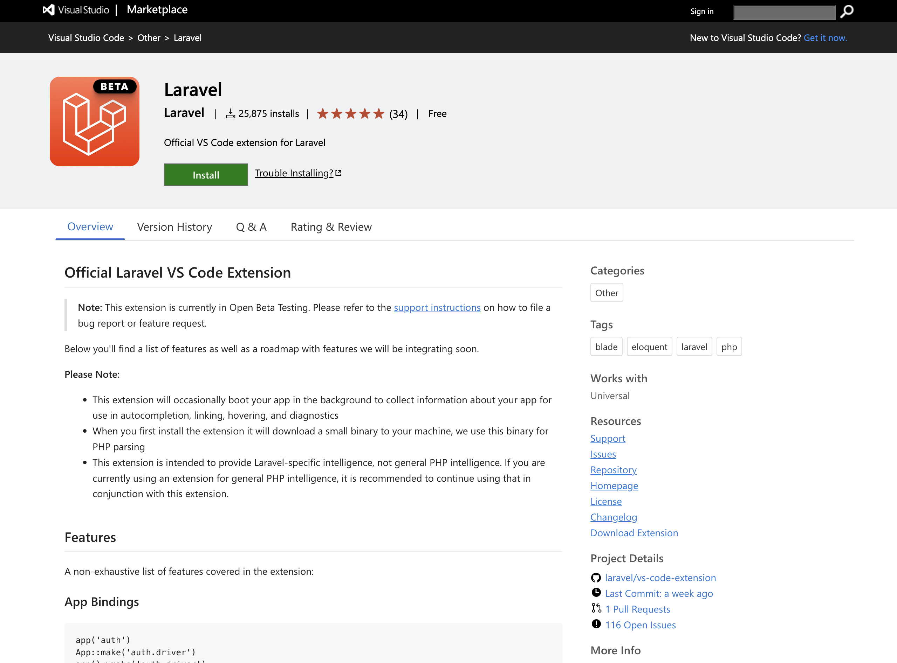

<style>
    img { margin: 20px 0; border-radius: 8px; }

    .alert { color: #BD1550; }
    .warning { color: #E97F02; }
    .success { color: #8A9B0F; }

    .center { text-align: center; }
    .right { text-align: right; }

    .img-small { max-width: 200px; margin: auto; }
    .img-medium { max-width: 400px; margin: auto; }
    .img-large { max-width: 800px; margin: auto; }

    .leyenda {
        font-size: small;
        margin: 10px 0;
    }
</style>

# Introducción a Laravel

> Duración estimada: 40 sesiones

## 7.1 Introducción

### ¿Qué es un framework?

Un **framework** proporciona una estructura base para el desarrollo de aplicaciones, facilitando tareas como:

- Conexión a bases de datos.
- Organización del código.
- Gestión de rutas y validaciones.

La mayoría de frameworks PHP siguen el **patrón MVC** (Modelo-Vista-Controlador), que permite separar claramente la lógica de negocio, la interfaz de usuario y los datos.

### ¿Por qué utilizar un framework?

Los frameworks ofrecen:

- **Estandarización**: Promueven buenas prácticas de desarrollo.
- **Eficacia**: Aceleración del desarrollo con herramientas preconstruidas.
- **Mantenibilidad**: Facilitan la escalabilidad y el mantenimiento del código.

Ejemplos de frameworks PHP populares:

- *Laravel*: Sintaxis clara, funcionalidades modernas, ideal para proyectos de cualquier tamaño.
- *Symfony*: Robusto y altamente modular, enfocado en aplicaciones complejas.
- *Slim*: Ligero e ideal para APIs RESTful.

### ¿Por qué elegir Laravel?

Laravel es uno de los frameworks más populares gracias a:

- **Facilidad de uso**: Sintaxis expresiva e intuitiva.
- **Patrón MVC**: Claramente implementado para separar lógica, vistas y datos.
- **ORM Eloquent**: Gestión intuitiva de bases de datos.
- **Migraciones**: Control de versiones para estructuras de bases de datos.
- **Artisan CLI**: Automatización de tareas habituales como migraciones o generación de modelos.
- **Blade**: Motor de plantillas con sintaxis simplificada.
- **Seguridad integrada**: Protección contra ataques como CSRF y XSS.

## 7.2 Instalación de Laravel

A continuación, se van a ver 3 alternativas distintas para instalar las dependencias necesarias para trabajar con Laravel en un entorno de desarrollo local. Elige la que más te convenga. Se pueden encontrar más opciones y las últimas recomendaciones directamente en la [documentación oficial](https://laravel.com/docs/11.x/installation).

### a. Manual

Lanzar el siguiente script de [php.new](https://php.new/) que instalará *PHP*, *Composer* y el instalador *Laravel* en el equipo.

=== "En macOS"

    ``` bash
    /bin/bash -c "$(curl -fsSL https://php.new/install/mac/8.4)"
    ```

=== "En Windows"

    ``` bash
    # Run as administrator...
    Set-ExecutionPolicy Bypass -Scope Process -Force; [System.Net.ServicePointManager]::SecurityProtocol = [System.Net.ServicePointManager]::SecurityProtocol -bor 3072; iex ((New-Object System.Net.WebClient).DownloadString('https://php.new/install/windows/8.4'))
    ```

Después de lanzar el comando de arriba hay que reiniciar la sesión de la terminal.

Si en cualquier momento queremos acutalizar PHP, Composer o el instalador de Laravel, bastará con volver a ejecutar el comando en la terminal.

*Si ya tenemos instalado PHP y Composer en el equipo*, sólo es necesario instalar Laravel de la siguiente forma:

``` bash
composer global require laravel/installer
```

#### Crear proyecto

Una vez tenemos instalados PHP, Composer y el instalador de Laravel en el equipo, para crear una aplicación con el nombre **example-app** vamos al directorio de nuestros proyectos y ejecutamos:

``` bash
laravel new example-app
```

Una vez creada la aplicación, hay que iniciar el servidor de desarrollo local usando el script dev de Composer:

``` bash
cd example-app
npm install && npm run build
composer run dev
```

Una vez iniciado el servidor de desarrollo, la aplicación será accesible en el navegador web en `http://localhost:8000`.

<figure style="align: center;">
    
    <figcaption>Creación de proyecto de forma manual</figcaption>
</figure>


### b. Laravel Herd

Herd es un entorno de desarrollo nativo de Laravel y PHP para macOS y Windows, increíblemente rápido. Incluye todo lo que necesitas para comenzar a desarrollar con Laravel, incluidos PHP y nginx. Una vez que instales Herd, estarás listo para comenzar a desarrollar con Laravel.

Puedes descargar Herd desde [aquí](https://herd.laravel.com/). Incluye la última versión de PHP y Composer y configura tu equipo para ejecutar el servidor web Nginx en segundo plano para servir automáticamente cualquier aplicación de Laravel en **~/Herd** a través de la URL formada por el nombre de su directorio y el dominio **.test**.

Ten en cuenta que la versión gratuita no tiene soporte para BBDD, por lo que ese servicio tendremos que proporcionarlo mediante XAMPP, Laragon, Docker...

Y como siempre, es recomendable echar un vistazo a la [documentación oficial de Herd](https://herd.laravel.com/docs).

#### Crear proyecto

Crear una nueva aplicación en Herd es muy sencillo. Hay que desplegar su menú, entrar a *Sites* y desde ahí clic en *+*. 

Seguir los pasos del script y por ejemplo, un proyecto con nombre **example-app** estará disponible en `http://example-app.test`.

<figure style="align: center;">
    
    <figcaption>Creación de proyecto de forma manual</figcaption>
</figure>


### c. Contenedores Docker

Laravel [Sail](https://laravel.com/docs/11.x/sail) es una interfaz de línea de comandos que permite crear una aplicación de Laravel con PHP, MySQL y Redis sin necesidad de tener experiencia previa con Docker.

Por ejemplo, para crear una aplicación con el nombre **example-app** ejecutaremos directamente el comando:

=== "En macOS"

    ``` bash
    curl -s "https://laravel.build/example-app" | bash
    ```

=== "En Windows"

    ``` bash
    curl -s https://laravel.build/example-app | bash
    ```

Una vez creados los contenedores, accedemos al directorio de la app y lanzamos Laravel Sail:

``` bash
cd example-app
./vendor/bin/sail up
```

Por último, lanzamos las migraciones de la BDD:

``` bash
./vendor/bin/sail artisan migrate
```

Y la aplicación ya es accesible desde `http://localhost/`.

Si queremos que funcione **phpmyadmin** hay que añadir otro contenedor docker a mano o incluyendo el siguiente código en el docker-compose.yml:

``` bash
phpmyadmin:
      image: 'phpmyadmin:latest'
      ports:
          - 8080:80
      environment:
          MYSQL_ROOT_PASSWORD: '${DB_PASSWORD}'
      links:
          - "mysql:db"
      depends_on:
          - mysql
      networks:
          - sail
```

Parando Laravel Sail y volviéndolo a lanzar ya lo tenemos funcionando:

``` bash
./vendor/bin/sail up
```

<figure style="align: center;">
    
    <figcaption>Contenedores de Laravel Sail</figcaption>
</figure>

!!! info "A tener en cuenta"
    Esta es la opción más sencilla para crear una aplicación con el servicio de BBDD incluido, pero la más lenta y costosa, ya que por cada aplicación se crean todos los contenedores asociados a ella.

## 7.3 Entornos de desarrollo

Puedes utilizar [VS Code](https://code.visualstudio.com/) con la [extensión oficial de Laravel](https://marketplace.visualstudio.com/items?itemName=laravel.vscode-laravel).

<figure style="align: center;">
    
    <figcaption>Extensión de Laravel para VS Code</figcaption>
</figure>

O si lo prefieres, también puedes probar [PhpStorm](https://www.jetbrains.com/es-es/phpstorm/laravel/) de forma gratuita con la cuenta del instituto.

<figure style="align: center;">
    
    <figcaption>IDE PhpStorm gratis para educación</figcaption>
</figure>

## 7.4 Estructura de una aplicación 

Al crear un nuevo proyecto con Laravel, se crean una serie de carpetas por defecto para ofrecer un punto de partida sólido para aplicaciones de cualquier tamaño siguiendo una estructura modular basada en el patrón MVC (Modelo-Vista-Controlador). Esta organización facilita la separación de responsabilidades, mantenimiento y escalabilidad. A continuación, se describen las carpetas más importantes.

- **app**: Contiene el código principal de la aplicación.
    - Models/ : Incluye las clases de los modelos Eloquent, que representan las tablas de tu base de datos y permiten interactuar con ellas de manera sencilla.
    - Http/ : Incluye controladores, middleware y solicitudes de formulario. Es el lugar donde se maneja la lógica relacionada con las solicitudes HTTP que entran en tu aplicación.
        - Http/Controllers/ : Controladores que procesan las peticiones y devuelven respuestas.
        - Http/Middleware/ : Clases para filtrar y procesar las peticiones antes de llegar a los controladores.
    - Policies/ : Gestionan la autenticación basada en permisos.
    - Providers: Almacena los proveedores de servicios de tu aplicación, que son responsables de inicializar componentes y enlazar servicios en el contenedor de servicios.
- **bootstrap**: Incluye el archivo app.php que inicia el framework y una carpeta cache con archivos generados para optimizar el rendimiento.
- **config**: Alberga todos los archivos de configuración de la aplicación. Es recomendable revisarlos para familiarizarse con las opciones disponibles.
- **database**: Gestión de bases de datos.
    - Migraciones/ : Archivos para definir la estructura de las tablas de manera programática.
    - Factorías/ : Generación de datos de prueba para los modelos.
    - Seeders/ : Inserción de datos iniciales para la base de datos.
- **public**: Contiene el archivo index.php, punto de entrada para todas las solicitudes, y los recursos públicos como imágenes, JavaScript y CSS.
- **resources**: Carpeta de recursos para la interfaz de usuario. Incluye las vistas y los recursos sin compilar, como archivos CSS o JavaScript.
    - views/ : Contiene las vistas Blade.
    - lang/ : Archivos de traducción para aplicaciones multilingües.
    - css/ y js/ : Recursos de estilo y funcionalidad del cliente.
- **routes**: Contiene las definiciones de rutas de la aplicación. 
    - web.php : Rutas para la aplicación web.
    - api.php : Rutas para APIs RESTful.
    - console.php : Pedidos Artisan personalizados.
    - channels.php : Rutas para canales de difusión.
- **storage**: Almacenamiento de archivos generados por la aplicación.
    - app/ : Contiene archivos de usuario o aplicación.
    - framework/ : Caché, sesiones, y otros archivos temporales.
    - logs/ : Registros de errores y actividad.
- **tests**: Contiene las pruebas automatizadas de la aplicación, con ejemplos de pruebas unitarias y de características.
    - Feature/ : Pruebas completas que cubren múltiples componentes.
    - Unit/ : Pruebas individuales para componentes o métodos específicos.
- **vendor**: Carpeta gestionada por Composer. Contiene todas las dependencias y paquetes de terceros utilizados por el proyecto. No debe modificarse manualmente.

Esta estructura es flexible, permitiendo reorganizar los componentes según las necesidades específicas del proyecto, siempre que Composer pueda cargar automáticamente las clases.

Es importante destacar que algunos de estos directorios no existen por defecto y se crean a medida que utilizas los comandos de Artisan para generar las clases correspondientes.

## 7.5 Rutas

Podríamos decir que existen dos tipos principales de rutas:

- **Rutas web**: Almacenadas en el archivo *web.php*, nos permiten cargar diferentes vistas en función de la URL que indique el cliente.
- **Rutas API**: Almacenadas en el archivo *api.php*, se utilizan para definir servicios REST.
  
En este tema, nos centraremos en las rutas web, por lo que editaremos el contenido del archivo `routes/web.php`. Este archivo es el punto centralizado para la definición de rutas. Cualquier ruta no definida en este archivo no será válida y generará un error 404.

Las rutas pueden:

1. Devolver directamente un valor desde el archivo de rutas. 
2. Llamar una vista o un controlador.

### Rutas simples

Una ruta simple tiene una URL fija y una función que devuelve una respuesta. Por ejemplo, una petición tipo GET se define así:

```php
<?php
Route::get('/saludo', function () {
  return 'Hola mundo!';
});
```

Cuando accedamos a `http://localhost/saludo` (localhost o el equivalente a nuestra app local o en remoto), Laravel devolverá "Hola mundo!".

### Rutas con parámetros

Se pueden definir **parámetros dinámicos** en las rutas mediante claves **{ }**. Por ejemplo:

```php
<?php
Route::get('/saludo/{nombre}', function ($nombre) {
  return 'Hola, ' . $nombre;
});
```

Si accedemos a `/saludo/Juan`, devolverá "Hola, Juan". Para definir un **parámetro opcional**, añadimos un símbolo **?**:

```php
<?php
Route::get('/saludo/{nombre?}', function ($nombre = "Invitado") {
  return 'Hola, ' . $nombre;
});
```

Ahora, `/saludo`, devolverá "Hola, Invitado".

### Validación de parámetros

Podemos **validar** los parámetros usando el método **where**. Por ejemplo:

```php
<?php
Route::get('/saludo/{nombre}', function ($nombre) {
  return 'Hola, ' . $nom;
})->where('nombre', '[A-Za-z]+');

Route::get('/producto/{id}', function ($id) {
  return 'Producto ID: ' . $id;
})->where('id', '[0-9]+');

Route::get('/usuario/{nombre}/{id}', function ($nombre, $id) {
  return 'Usuario: ' . $nombre . ', ID: ' . $id;
})->where(['nombre' => '[A-Za-z]+', 'id' => '[0-9]+']);
```

### Rutas con nombre (alias)

Podemos darle un alias o un **nombre** a nuestras rutas mediante el método **name** para poder referenciarlas fácilmente desde nuestras plantillas de Laravel, como se verá más adelante..

```php
<?php
Route::get('/contacto', function () {
  return 'Página de contacto';
 })->name('contacto');
```

Podemos utilizar el nombre de la ruta en las plantillas Blade:


```php
<?php
[Contacto]({{ route('contacto') }})
```

### Grupos de rutas

Laravel permite **agrupar rutas** mediante el método **prefix** para compartir configuraciones como prefijos o middleware:

```php
<?php
Route::prefix('admin')->group(function () {
  Route::get('/dashboard', function () {
    return 'Admin Dashboard';
  });

  Route::get('/usuarios', function () {
    return 'Admin Usuarios';
  });
});
```

Esto crea las rutas `/admin/dashboard` y `/admin/usuarios`.

### Rutas con controladores

Para gestionar lógica más compleja, es **recomendable utilizar controladores** y que sean ellos quienes llamen a la vista correspondiente:

```php
<?php
// Llamada al método 'mostrar' de UsuarioController pasándole el $id como parámetro
Route::get('/usuario/{id}', [UsuarioController::class, 'mostrar']);

// Controlador definido mediante Artisan
// php artisan make:controller UsuarioController

```

### Recursos y APIs

Si queremos hacer **CRUDs** podemos definir rutas directamente con el método **resource**:


```php
<?php
Route::resource('articles', ArticleController::class);
```

Este método genera automáticamente las rutas para acciones como index, create, store, show, edit, update y destroy.

!!! info "Ampliar sobre rutas"
    Para más información acerca de las rutas, parámetros y expresiones regulares en las rutas puedes echar un vistazo a la [documentación oficial de rutas](https://laravel.com/docs/11.x/routing) que contiene numerosos ejemplos.

## 7.6 Vistas

Las vistas son la forma de presentar el resultado (una pantalla de nuestro sitio web) de forma visual al usuario. Laravel permite estructurar esta parte de la aplicación utilizando **vistas simples** o **plantillas Blade**, una herramienta potente para modularizar y reutilizar el código de nuestras vistas.

### ¿Qué son las vistas?

Las vistas se definen en la carpeta *resources/views* y están diseñadas para separar la parte visual de la lógica de la aplicación. Esta separación mejora la estructura del proyecto y facilita el mantenimiento del código.

Las vistas no deben contener lógica de negocio ni realizar consultas a bases de datos. Sólo deben recibir datos de los controladores y presentarlos al usuario.

### Mostrar una vista

Para mostrar una vista, podemos devolver la función **view** desde una ruta o método de un controlador.

```php
<?php
Route::get('/', function () {
  return view('welcome');
});
```

### Pasar datos a una vista

Es habitual pasar datos a las vistas desde una ruta o controlador.

1. Con **with***:

```php
<?php
Route::get('/', function () {
  $nombre = 'Juan';
  return view('welcome')->with('nombre', $nombre);
});
```

2. Con un **array asociativo**:

```php
<?php
  $nombre = 'Juan';
  return view('welcome', ['nombre' => $nombre]);
```

3. Con la función **compact**, que genera un array asociativo utilizando los nombres de las variables que se le pasan como argumentos:

```php
<?php
  $nombre = 'Juan';
  return view('welcome', compact('nombre'));
```

4. Utilizando la función **Route::view**:

```php
<?php
Route::view('/', 'welcome', ['nombre' => 'Juan']);
```

En la vista, podemos utilizar Blade para mostrar estos datos:

```php
  Bienvenido/a, {{ $nombre }}
```

### Plantillas Blade

A través de las plantillas de Laravel vamos a escribir menos código PHP y vamos a tener nuestros archivos mejor organizados.

**Blade** es el sistema de plantillas que trae Laravel, por eso los archivos de plantillas que guardamos en el directorio de `views` llevan la extensión `blade.php`.

De esta manera sabemos inmediatamente que se trata de una plantilla de Laravel y que forma parte de una vista que se mostrará en el navegador.

#### Directivas

Laravel tiene un gran número de directivas que podemos utilizar para ahorrarnos mucho código repetitivo entre otras funciones.

Digamos que las directivas son pequeñas funciones ya escritas que aceptan parámetros y que cada una de ellas hace una función diferente dentro de Laravel.

- `@yield` Define el contenido dinámico que se va a cargar. Se usa conjuntamente con @section.
- `@section` y `@endsection` bloque de código dinámico.
- `@extends` importa el contenido de una plantilla ya creada.

#### Separando código

Veamos un ejemplo de cómo hacer uso del poder de Laravel para crear plantillas y no repetir código.

Supongamos que tenemos ciertas estructuras HTML repetidas como puede ser una cabecera `header`, un menú de navegación `nav` y un par de secciones que hacen uso de este mismo código.

Supongamos que tenemos 2 apartados en la web:

- `Blog`
- `Fotos`

Primero de todo tendremos que generar un archivo que haga de `plantilla` de nuestro sitio web.

Para ello creamos el archivo `plantilla.blade.php` dentro de nuestro directorio de plantillas `resources/views`.

Dicho archivo va a contener el típico código de una página simple de HTML y en el body añadiremos nuestros contenido estático y dinámico.

```html
<body>
    <!-- CONTENIDO ESTÁTICO PARA TODAS LAS SECCIONES -->
    <h1>Bienvenid@s a Laravel</h1>
    <hr>
    
    <!-- MENÚ -->
    <nav>
        <a href={{ route('noticias') }}>Blog</a> | 
        <a href={{ route('galeria') }}>Fotos</a>
    </nav>

    <!-- CONTENIDO DINÁMICO EN FUNCIÓN DE LA SECCIÓN QUE SE VISITA -->
    <header>
        @yield('apartado')
    </header>
</body>
```

Cada sección que haga uso de esta plantilla contendrá el texto estático `Bienvenid@s a Laravel` seguido de un menú de navegación con enlaces a cada una de las secciones y el contenido dinámico de cada sección.

Ahora crearemos los archivos dinámicos de cada una de las secciones, en nuestro caso `blog.blade.php` y `fotos.blade.php`

```php
<?php
// blog.blade.php
@extends('plantilla')

@section('apartado')
  <h2>Estás en BLOG</h2>
@endsection
```

Importamos el contenido de `plantilla` bajo la directiva `@extends` para que cargue los elementos estáticos que hemos declarado y con la directiva `@section` y `@endsection` definimos el bloque de código dinámico, en función de la sección que estemos visitando.

Ahora casi lo mismo para la sección de `fotos`

```php
<?php
// fotos.blade.html
@extends('plantilla')

@section('apartado')
  <h2>Estás en FOTOS</h2>
@endsection
```

El último paso que nos queda es configurar el archivo de rutas `routes/web.php`

```php
<?php
// web.php
Route::view('blog', 'blog') -> name('noticias');
Route::view('fotos', 'fotos') -> name('galeria');
```

De esta manera podremos hacer uso del menú de navegación que hemos puesto en nuestra plantilla y gracias a los alias `noticias` y `galeria`, la URL será más amigable.

#### Estructuras de control

En Blade siempre que iniciemos un bloque de estructura de control DEBEMOS cerrarlo. Tenemos las siguientes estructuras:

- `@foreach` ~ `@endforeach` lo usamos para recorrer arrays.
- `@if` ~ `@endif` para comprobar condiciones lógicas.
- `@switch` ~ `@endswitch` en función del valor de una variable ejecutar un código.
    - `@case` define la casuística del switch.
    - `@break` rompe la ejecución del código en curso.
    - `@default` si ninguna casuística se cumple.

Ejemplos:

```php
<?php
$equipo = ['María', 'Alfredo', 'William', 'Verónica'];
$edad = 21;
$opcion = 2;

// en la plantilla blade
@foreach($equipo as $nombre)
  <p> {{ $nombre }} </p>
@endforeach


@if($edad>18)
  <p>Adelante, con {{ $edad }} accedes sin problemas.</p>
@elseif($edad>16)
  <p>Con {{ $edad }} accedes con autorización de tus padres.</p>
@else
  <p>Lo siento, con {{ $edad }} no puedes acceder.</p>
@endif


@switch($opcion)
  @case(1)
    <p>Opción 1...</p>
    @break
  @case(2)
    <p>Opción 2...</p>
    @break
  @default
    <p>Opción {{ $opcion }} no es válida.</p>
@endswitch
```

#### Componentes Blade

Los Componentes Blade permiten definir elementos reutilizables:

1. **Crear componente** de ejemplo 'Alert': 

``` bash
php artisan make:component Alert
```

Esto, creará 2 archivos:

- Component [app/View/Components/Alert.php] created successfully.  
- View [resources/views/components/alert.blade.php] created successfully. 

2. **Definir la lógica** en *app/View/Components/Alert.php*: 

``` php
<?php
class Alert extends Component{
    public string $type;
    // Create a new component instance.
    public function __construct($type = 'info') {
        $this->type = $type;
    }

    // Get the view / contents that represent the component.
    public function render(): View|Closure|string {
        return view('components.alert');
    }
}
```

3. **Definir la vista** en *resources/views/components/alert.blade.php*: 

```html
<div class="border rounded-lg shadow-md p-4 bg-white">
    <p><strong>Alerta tipo:</strong> {{ $type }}</p>
</div>
```

4. **Usar el componente** en una vista:

```html
<x-alert type="Notificación" />
```

Las expresiones y variables PHP se deben pasar al componente mediante atributos que utilicen el carácter *:* como prefijo. Ejemplo:

```php
<x-alert :type="$tipos[5]" />
```

!!! info "Ampliar sobre vistas"
    Para más información acerca de las vistas, incluso la reciente posibilidad de crearlas mediante React o Vue gracias a Inertia, seguir la [documentación oficial de vistas](https://laravel.com/docs/11.x/views). Y para aquí para más info sobre [las plantillas Blade](https://laravel.com/docs/11.x/blade).

## 7.7 CSS y JS en el cliente

Ahora que ya conocemos cómo utilizar Blade para modularizar nuestras vistas, es momento de añadir estilos CSS y scripts Javascript para mejorar la presentación y funcionalidad de nuestro proyecto Laravel integra **Vite**, una herramienta moderna para gestionar y empaquetar los recursos del frontend.

### ¿Qué es Vite?

Vite es una herramienta de construcción de frontend que ofrece un entorno de desarrollo extremadamente rápido y empaqueta el código para producción. Con Laravel, Vite permite:

- Gestionar archivos CSS y Javascript del proyecto.
- Optimizar los recursos para la producción.
- Cargar los cambios en tiempo real durante el desarrollo.

### Conector Vite

Laravel incluye por defecto un conector oficial para trabajar con Vite. 

En la raíz del proyecto se encuentra el archivo *package.json* con las dependencias del frontend, incluido el conector de Laravel para Vite. Para instalarlas, ejecuta desde consola:

``` bash
npm install
```

### Configuración de Vite

La configuración de Vite se encuentra en el archivo *vite.config.js*, donde se definen los puntos de entrada (CSS y Javascript) del proyecto:

``` js
import { defineConfig } from 'vite';
import laravel from 'laravel-vite-plugin';

export default defineConfig({
    plugins: [
        laravel({
            input: [
                'resources/css/app.css', 
                'resources/js/app.js'],
            refresh: true,
        }),
    ],
});
```

Es posible añadir complementos adicionales si utilizas frameworks como Vue o React.

### Cargar CSS y JS en las vistas

Una vez configurados los puntos de entrada en el archivo *vite.config.js*, puedes cargar los recursos en las vistas utilizando la directiva **@vite** de Blade. Por ejemplo:

``` html
<head>
      <meta charset="UTF-8">
      @vite(['resources/css/app.css'])
</head>
<body class="font-sans bg-gray-100 text-gray-900">
  ...
```

Esta directiva se encarga automáticamente de: 

- Reemplazo de módulos en vivo (Hot Module Replacement - HMR): Los módulos se actualicen en tiempo de ejecución sin necesidad de una actualización de la página completa.
- Cargar los archivos versionados en producción.

### Ejecutar Vite

Podemos ejecutar Vite según estemos en desarrollo o producción:

1. **Desarrollo**: Ejecutar el servidor de Vite para reflejar los cambios automáticamente en el navegador.

``` bash
npm run dev
```

2. **Producción**: Empaquetar y versionar los recursos en su version final para producción.

``` bash
npm run build
```

## 7.8 Controladores

Los controladores son una pieza clave en Laravel para organizar y estructurar la lógica de nuestra aplicación. Permiten separar la gestión de las rutas y la lógica del negocio, haciendo que el código sea más limpio, escalable y fácil de mantener.

Por defecto, los controladores se guardan en una carpeta específica situada en `app/Http/Controllers` y tienen extensión `.php`.

### Crear un controlador

Artisan nos va a facilitar la creación de un controlador. Abrimos una terminal y desde la raíz del proyecto ejecutamos `php artisan make:controller NombreController`. Por convención, los controladores suelen acabar con el sufijo Controller. 

Ejemplo:

```console
php artisan make:controller PagesController
```

Si todo ha salido bien, recibiremos un mensaje por consola con que todo ha ido bien y podremos comprobar que, efectivamente se ha creado el archivo `PagesController.php` con una estructura básica de controlador, dentro de la carpeta `Controllers` que hemos descrito anteriormente.

### Separar la lógica

Ahora podemos modificar nuestro archivo de rutas `web.pbp` para dejarlo limpio de lógica y trasladar ésta a nuestro nuevo controlador. La idea es dejar `web.php` tan limpio como podamos para que, de un vistazo, se entienda todo perfectamente.

**RECUERDA** que sólo movemos la lógica, mientras que las cláusulas como `where` y `name` las seguimos dejando en el archivo de rutas `web.php`

Veamos cómo quedaría un refactor del archivo de rutas utilizando un `Controller` como el que acabamos de crear:

```php
<?php
// web.php (v2.0) ▒▒▒▒ Refactorizado

use App\Http\Controllers\PagesController;
use Illuminate\Support\Facades\Route;

Route::get('/', [ PagesController::class, 'inicio' ]);
Route::get('datos', [ PagesController::class, 'datos' ]);
Route::get('cliente/{id?}', [ PagesController::class, 'cliente' ]) -> where('id', '[0-9]+');
Route::get('nosotros/{nombre?}', [ PagesController::class, 'nosotros']) -> name('nosotros');
```

y en nuestro archivo controlador lo dejaríamos de la siguiente manera

```php
<?php
// PagesController.php
namespace App\Http\Controllers;

class PagesController extends Controller
{
    public function inicio() { 
      return view('welcome'); 
    }

    public function datos() { 
      return view('usuarios', ['id' => 56]);
    }

    public function cliente($id = 1) {
      return ('Cliente con el id: ' . $id);
    }

    public function nosotros($nombre = null) {
      $equipo = ['Paco', 'Enrique', 'Maria', 'Veronica'];
      return view('nosotros', compact('equipo', 'nombre'));
    }
}
```

### Controlador de recursos

Podemos generar un controlador de recursos con la opción **-r**. Esto creará un controlador con métodos predeterminados para operaciones comunes. Ejemplo:

```console
php artisan make:controller PhotoController -r
```

Los métodos generados son:

- **index**: Mostrar un listado de elementos.
- **create**: Mostrar un formulario para crear un nuevo elemento.
- **store**: Almacenar un nuevo elemento en la base de datos.
- **show**: Mostrar un elemento específico.
- **edit**: Mostrar un formulario para editar un elemento existente.
- **update**: Actualizar un elemento en la base de datos.
- **destroy**: Eliminar un elemento.

Estos métodos se llaman desde el archivo de rutas exactamente igual que los métoodos hechos a mano antes, aunque también tenemos la opción de registrar todas las rutas automáticamente mediante el método **Route::resource**:

```php
<?php
// web.php (v2.0) ▒▒▒▒ Refactorizado
Route::resource('photos', PhotoController::class);
```

Las acciones manejadas por el controlador de recursos con su URI y nombre de la ruta:

| Verb        | URI                  | Action   | Route Name      |
|-------------|----------------------|----------|-----------------|
| GET         | /photos              | index    | photos.index    |
| GET         | /photos/create       | create   | photos.create   |
| POST        | /photos              | store    | photos.store    |
| GET         | /photos/{photo}      | show     | photos.show     |
| GET         | /photos/{photo}/edit | edit     | photos.edit     |
| PUT/PATCH   | /photos/{photo}      | update   | photos.update   |
| DELETE      | /photos/{photo}      | destroy  | photos.destroy  |

### Organización de vistas

Las vistas asociadas a un controlador suelen estar estructuradas dentro de la carpeta *resources/views* en una **subcarpeta con nombre del controlador o modelo**. Ejemplo:

- Controlador: PhotoController
- Vistas: resources/views/**photo**/index.blade.php, resources/views/**photo**/show.blade.php, etc.

Para renderizar estas vistas desde el controlador se usa *carpeta.vista*:

```php
<?php
// PhotoController.php
public function index() {
  return view('photo.index');
}
```

### Organización de controladores

Los controladores también se pueden organizar en subcarpetas dentro de *app/Http/Controllers*. Para crearlo se indica la subcarpeta:

```console
php artisan make:controller Photo/AdminController
```

Y a la hora de utilizarlo, hay que incluir su espacio de nombres:

```php
<?php
// web.php 
Route::get('admin', [App\Http\Controllers\Photo\AdminController::class, 'method']);
```

!!! info "Ampliar sobre controladores"
    Para más información acerca de los controladores, seguir la [documentación oficial de controladores](https://laravel.com/docs/11.x/controllers).


<!--
## Referencias

* Curso de Laravel de www.pildorasinformaticas.es: <https://www.pildorasinformaticas.es/course/laravel/>
* Libro / Apuntes sobre Laravel 5 en castellano: <https://richos.gitbooks.io/laravel-5>
* Apuntes Laravel creados por `igomis`, docente del IES Batoi de Alcoy(valenciano): https://igomis.github.io/apunts/
-->

## Actividades

701. Crea un sitio web con Laravel que contenga el título "Bienvenidos a Laravel", un texto de bienvenida (puede ser un poco de Lorem Ipsum) y a continuación un menú de navegación con sus correspondientes alias y los siguientes enlaces:

  - `Inicio` enlace a la página principal donde se visualizará el texto de Lorem Ipsum además de los elementos estáticos (Título y menú de navegación).

  - `Nosotros` enlace que vaya a la página "nosotros"  y muestre, además de los elementos estáticos de todo el sitio, un h2 que diga "Estás en la sección Nosotros"

  - `Proyecto` enlace que cargue una vista con el siguiente texto "Estás en el proyecto numero: X" donde X es un número entero que podamos introducirlo en la propia ruta. Si no se mete ningún número en la ruta, por defecto tiene que ser 1; por ejemplo

        http://localhost:8000/proyecto/210937

  - Recuerda que el título y el menú de navegación han de aparecer en todas las vistas que cargues.

---


702. Utilizando las `estructuras` de control y los `controladores` crea un sitio web que contenga lo siguiente:

  - `Inicio` página principal con un título que diga "Bienvenid@s a FOTO ░▒▓ BLOG" y un texto de bienvenida (con un par de frases sobra)

  - `Nosotros` un título de la sección en la que te encuentras y un listado de 3 personas diferentes que, cada uno de los nombres mostrará un texto descriptivo de cada persona cuando pinchemos sobre su nombre.

  - `Fotos` Una sección que aparezca el texto "Estás visualizando la foto con el ID: X" donde X es un parámetro que dependerá de la ruta que se haya introducido. Por defecto, si no se introduce dicho parámetro éste debe valer 1. 

  - Como elementos estáticos debe aparecer:
      - `Imagen` como logtipo
      - El título `FOTO ░▒▓ BLOG` a la derecha del logotipo
      - `Menú` de navegación para moverse por las distintas secciones

  - Puedes usar Bootstrap como algo opcional para practicar. Recuerda que viene incluido con la instalación de Laravel.

---
