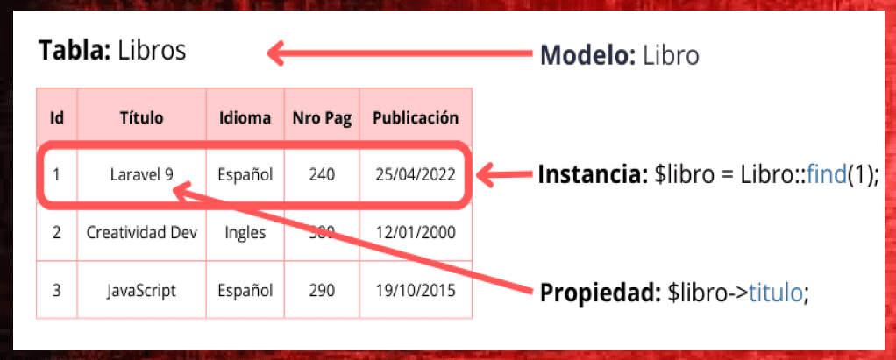

<style>
    img { margin: 20px 0; border-radius: 8px; }

    .alert { color: #BD1550; }
    .warning { color: #E97F02; }
    .success { color: #8A9B0F; }

    .center { text-align: center; }
    .right { text-align: right; }

    .img-small { max-width: 200px; margin: auto; }
    .img-medium { max-width: 400px; margin: auto; }
    .img-large { max-width: 800px; margin: auto; }

    .leyenda {
        font-size: small;
        margin: 10px 0;
    }
</style>

# Gestión de datos en Laravel

> Duración estimada: 20 sesiones

## 8.1 Introducción

Laravel es un framework PHP moderno que simplifica el desarrollo de aplicaciones web, incluyendo la gestión de bases de datos. La integración con Eloquent, su ORM (Object Relational Mapping), permite trabajar con bases de datos de forma intuitiva y eficiente.

## 8.2 Configuración inicial

Laravel soporta varios motores de bases de datos como MySQL, PostgreSQL, SQLite y SQL Server. La configuración principal se realiza en el archivo `.env`. 

**Ejemplo de configuración en .env:**

```console
DB_CONNECTION=mysql
DB_HOST=127.0.0.1
DB_PORT=3306
DB_DATABASE=nombre_base_datos
DB_USERNAME=usuario
DB_PASSWORD=password
```

Nota: El servidor MySQL debe estar funcionando con la base de datos <span class="alert">***ya creada***</span>

**Comprobar conexión:**

El siguiente comando confirma si Laravel puede conectarse a la base de datos configurada.

`php artisan migrate:status`

**Posibles problemas:**

- La extensión del driver de la base de datos (como *pdo_mysql* o *pdo_pgsql*) debe estar habilitada en el `php.ini`.
- Utilizar `php artisan config:clear` para borrar la caché de configuraciones si los cambios del `.env` no se reflejan.

**Lanzar migraciones:**

Si la conexión va bien, lanzamos las migraciones:

```console
php artisan migrate
```

Si todo ha salido bien obtendremos el siguiente resultado donde podremos observar que todas las migraciones se han insertado correctamente en la base de datos.

<div class="center img-large">
    
</div>

Si nos vamos al cliente que utilicemos para manejar la base de datos (phpMyAdmin por ejemplo) veremos que en nuestra base de datos se han creado todas las tablas de la migración que hemos ejecutado y **además** una tabla que se llama <span class="success">***migrations***</span>.

La tabla `migrations` es simplemente un registro de todas las migraciones llevadas a cabo.

## 8.3 Migraciones

### Introducción

Las migraciones son un sistema de control de versiones para bases de datos que permite trabajar de forma colaborativa, manteniendo un histórico de los cambios realizados en el esquema. Con las migraciones se puede: 

- Crear, modificar y borrar tablas. 
- Gestionar el esquema de forma programática utilizando **Artisan** y el **Schema Builder**. 
- Revertir cambios mediante **rollback** o volver a aplicar todos los cambios con **refresh**.

### Estructura de las migraciones

Las migraciones de un proyecto Laravel se guardan en el directorio *database/migrations* en archivos `.php` y siguen una estructura predefinida con dos métodos principales: 

- **up**: Define las operaciones que deben aplicarse en la base de datos (crear tablas, añadir columnas, etc.). 
- **down**: Define las operaciones inversas para revertir (rollback) los cambios aplicados por up.

Ejemplo:

```php
<?php
public function up()
{
    Schema::create('usuarios', function (Blueprint $tabla) {
        $tabla->id();
        $tabla->string('nombre');
        $tabla->string('email')->unique();
        $tabla->timestamps();
    });
}

public function down()
{
    Schema::dropIfExists('usuarios');
}
```

Por defecto, Laravel añade un campo autonumérico *id* y si se llama al método `timestamps()`, dos columnas *created_at* y *updated_at* que se actualizan automáticamente para saber cuándo se creó y actualizó un registro.

### Crear una migración

Mediante el comando `make:migration` de Artisan generamos una migración, un archivo con las instrucciones (Schema Builder) para construir o cambiar las tablas de la base de datos. En el nombre de dicho archivo se incluye un timestamp para asegurar el orden cronológico.

**Ejemplos:**

```bash
# Migración en blanco
php artisan make:migration nombre_migración 

# Migración para crear una tabla
php artisan make:migration create_table_usuarios --create=usuarios  

# Migración para modificar una tabla
php artisan make:migration add_fields_to_usuarios --table=usuarios 
```

Laravel puede inferir acciones del nombre de la migración gracias a la clase **TableGuesser**. Por ejemplo, si el nombre contiene *create* o *to*, Artisan deducirá si es para crear o modificar tablas.

### Ejecutar migraciones

- `php artisan migrate`: Ejecuta las migraciones pendientes.
- `php artisan migrate:status`: Muestra el estado de las migraciones.
- `php artisan migrate:fresh`: Borra todas las tablas de la BDD (sin ejecutar rollback) y ejecuta todas las migraciones.
- `php artisan migrate:refresh`: Hace un rollback de todas las migraciones y las vuelve a ejecutar. Para rellenar la BDD con datos de prueba, usar el flag --seed.
- `php artisan migrate:reset`: Hace un rollback de todas las migraciones.
- `php artisan migrate:rollback`: Revierte la la última migración.

### Schema Builder

La clase **Schema** es el kernel para definir y modificar el esquema de las bases de datos. Incluye constructores para crear, modificar y eliminar tablas y columnas. Y es lo que utilizaremos dentro de los archivos de migraciones.

#### Crear y eliminar tablas

```php
<?php
Schema::create('usuarios', function (Blueprint $table) {
    $table->id();
    $table->string('nombre', 32);
    $table->timestamps();
});

Schema::dropIfExists('usuarios');
```

#### Añadir y eliminar columnas

```php
<?php
Schema::table('usuarios', function (Blueprint $table) {
    $table->string('telefono')->after('nombre')->nullable();
});

Schema::table('usuarios', function (Blueprint $table) {
    $table->dropColumn('telefono');
});
```

#### Tipos de columnas

Laravel ofrece una amplia variedad de tipos de columnas que puedes consultar en la [documentación oficial](https://laravel.com/docs/11.x/migrations#available-column-types).

#### Índices

```php
<?php
$table->primary('id'); // Campo id como clave primaria
$table->primary(['nombre', 'apellidos']); // Clave primaria compuesta
$table->unique('email'); // Campo email único
$table->index('localidad'); // Campo localidad como índice
```

#### Claves foráneas

```php
<?php
Schema::table('posts', function (Blueprint $table) {
    $table->unsignedBigInteger('user_id');
    $table->foreign('user_id')->references('id')->on('usuarios');
});
```

Laravel proporciona mediante el método `foreignId` una forma más concisa de hacer lo anterior, creando automáticamente el *unsignedBigInteger* y determinando la tabla a la que hace referencia (user) por el nombre del campo.

```php
<?php
Schema::table('posts', function (Blueprint $table) {
    $table->foreignId('user_id')->constrained();
});
```

Si la tabla a la que hace referencia no sigue las convenciones de nombres de Laravel, se puede indicar a mano la referencia.

```php
<?php
$table->foreignId('user_id')->constrained(
    table: 'usuarios', indexName: 'id_usuario'
);
```

Y también se puede especificar si queremos que los registros de la tabla actual se actualicen o borren en cascada según lo haga el registro de la tabla principal.

```php
<?php
$table->foreignId('user_id')
      ->constrained()
      ->onUpdate('cascade')
      ->onDelete('cascade');
```

## 8.4 Query Builder

El **Query Builder** de Laravel proporciona una interfaz fluida para construir y ejecutar consultas de bases de datos. Permite trabajar con varias bases de datos de forma sencilla sin escribir código SQL.

Es ideal para crear *consultas personalizadas* en las que el rendimiento es una prioridad y *consultas complejas* que no se pueden expresar fácilmente con Eloquent.

**Ejemplos de consultas:**

```php
<?php
// Obtener todos los registros de users
$users = DB::table('users')->get(); 

// Filtrar registros
$users = DB::table('users')->where('type', 'customer')->get();

// Seleccionar columnas
$users = DB::table('users')->select('name', 'email')->get();

// Ordenar resultados
$users = DB::table('users')->orderBy('name', 'asc')->get();

// Contar registros
$count = DB::table('users')->count();

// Agregados
$maxSalary = DB::table('employees')->max('salary');

// Subconsultas
$users = DB::table('users')
    ->whereExists(function($query) {
        $query->select(DB::raw(1))
              ->from('orders')
              ->whereColumn('orders.user_id', 'users.id');
    })
    ->get();
```

**Ejemplos de manipulación de datos:**

```php
<?php
// Insertar registro
DB::table('users')->insert([
    'name' => 'John Doe',
    'email' => 'john@example.com',
]);

// Actualizar registro
DB::table('users')
    ->where('id', 1)
    ->update(['name' => 'Updated Name']);

// Eliminar registro
DB::table('users')
    ->where('id', 1)
    ->delete();

// Borrar todos los registros
DB::table('users')->truncate();
```

## 8.5 Eloquent

### Introducción

Un **ORM (Object-Relational Mapping)** es una técnica de programación que permite eliminar la disparidad entre el modelo de datos de una base de datos relacional y el modelo de objetos de una aplicación. Mientras que en una BDD pensamos en tablas y campos, en el mundo de desarrollo pensamos en objetos y propiedades.

Ventajas de un ORM:

- **Abstracción de la base de datos**: No es necesario escribir SQL, ya que el ORM se encarga de traducir las operaciones de la base de datos a objetos.
- **Nombres de campos y tablas**: No es necesario recordar los nombres de las tablas y campos, ya que el ORM se encarga de ello. Si cambiamos el nombre de un campo, solo tenemos que cambiarlo en un lugar, en el modelo.
- **Relaciones**: Las relaciones entre tablas se pueden definir en los modelos, y el ORM se encarga de gestionarlas. Atravesar relaciones es tan sencillo como acceder a una propiedad de un objeto.

**Eloquent** es el ORM de Laravel, y nos permite interactuar con la base de datos de una forma sencilla y elegante. Eloquent es una capa de abstracción de la base de datos, que nos permite interactuar con ella utilizando objetos. 

Cada tabla de la base de datos tiene un modelo asociado, que es una clase que representa a la tabla. Por tanto:

- las tablas son modelos
- los registros de la tabla son instancias de ese modelo
- los campos de una tabla son propiedades del modelo

<figure style="align: center;">
    
    <figcaption>Relación entre tabla y modelo</figcaption>
</figure>

### Modelos

Los modelos son uno de los componentes más importantes de Laravel, son los responsables de interactuar con nuestra base de datos de una manera orientada a objetos. Representan las tablas de la base de datos como clases en la aplicación, permiten realizar operaciones para seleccionar, crear, actualizar y eliminar datos de una manera más sencilla y estructurada.

#### Crear un modelo

Los modelos se definen dentro de la carpeta *app/Models* y se pueden crear mediante Artisan:

```console
php artisan make:model Nota -m
```

!!! danger "Nombrar correctamente"
    El nombre del modelo empieza por Mayúscula y siempre se escribe en **SINGULAR***. 
    
    Si le pasamos el parámetro **-m** además creará la migración con el código para crear la tabla correspondiente en la BDD, cuyo nombre irá en minúscula y plural.

??? info "Opciones al crear el modelo"
    Podemos añadir las siguientes opciones al comando para crear otros elementos relacionados con el modelo:

    - **-c**, --controller: Crea un controlador.
    - **-m**, --migration: Crea una migración.
    - **-r**, --resource: Crea un controlador y una vista.
    - **-f**, --factory: Crea un factory.
    - **-s**, --seed: Crea un seeder.
    - **-a**, --all: Crea un controlador, una migración y una vista.
  
    Por ejemplo, si queremos crear un modelo, una migración y un controlador, ejecutamos:

    ```console
    php artisan make:model Nota -cm 
    ```

Si todo ha salido bien, veremos en nuestro directorio de migraciones `database/migrations` un nuevo archivo con un nombre similar a `2025_01_21_111237_create_notas_table.php` en el que se encuentra la tabla relacionada y que podemos abrir para seguir añadiendo campos mediante el **Schema Builder** como se ha visto anteriormente. Por ejemplo:

```php
<?php

Schema::create('notas', function (Blueprint $table) {
  $table->id();
  $table->timestamps();
  // Campos añadidos
  $table->string('nombre'); 
  $table->text('descripcion');
  $table->integer('prioridad');
});
```

Una vez tengamos listo nuestro esquema debemos lanzar `php artisan migrate` para que ejecute las migraciones pendientes introduciendo la nueva información en la base de datos.

#### Uso básico de un modelo

**Recuperar datos**

```php
<?php
// Todos los registros
$notas = Nota::all();

// Registros filtrados
$notas = Nota::where('prioridad', '>', 5)->get();

// Registro único
$nota = Nota::findOrFail($id);
```

**Insertar datos**
```php
<?php
$nota = new Nota();
$nota->titulo = "Proyecto Laravel";
$nota->descripcion = "Programar la parte de los modelos de la práctica de Fútbol Femenino.";
$nota->prioridad = 10;
$nota->save();
```

**Actualizar datos**
```php
<?php
$nota = Nota::find($id);
$nota->titulo = "Nuevo título";
$nota->save();
```

**Eliminar datos**
```php
<?php
$nota = Nota::find($id);
$nota->delete();
```

#### Propiedades comunes de los modelos Eloquent

En los modelos podemos definir varias propiedades para configurar el comportamiento de la interacción con la base de datos. A continuación se detallan las más importantes:

```php
<?php
namespace App\Models;

use Illuminate\Database\Eloquent\Model;

class Example extends Model
{
    // Especifica el nombre de la tabla si no sigue la convención de nombres de Laravel
    protected $table = 'custom_table_name';

    // Define la clave primaria de la tabla
    protected $primaryKey = 'custom_id';
    // Indica si la clave primaria es autoincremental
    public $incrementing = false;
    // Especifica el tipo de la clave primaria (si no es integer)
    protected $keyType = 'string';

    // Define qué atributos pueden ser asignados masivamente (a través de métodos como create o update)
    protected $fillable = ['name', 'email', 'password'];
    // Contrario a $fillabel. Define qué atributos no pueden ser asignados masivamente
    protected $guarded = ['is_admin'];

    // Define los atributos a ocultar al serializar el modelo (a JSON o array)
    protected $hidden = ['password', 'remember_token'];
    // Contrario a $hidden, define los atributos que serán visibles al serializar
    protected $visible = ['name', 'email'];

    // Transformación automática de los atributos a un tipo específico
    protected $casts = [
        'is_admin' => 'boolean',
        'settings' => 'array',
    ];

    // Indica si la tabla tiene los campos `created_at` y `updated_at`
    public $timestamps = true;

    // Defineix la conexión a la BDD
    protected $connection = 'mysql';
}
```


### Recuperando datos

Ya tenemos nuestra base de datos creada con nuestras tablas migradas, ahora sólo falta rellenar esas tablas con datos para poder pintarlos en nuestro código HTML.

Rellenamos las tablas a través del cliente de MySQL que más nos guste:

- PHPMyAdmin
- [MySQL Workbench](https://www.mysql.com/products/workbench/)
- [HeidiSQL](https://www.heidisql.com/download.php) *
- [SquirrelSQL](http://www.squirrelsql.org/#installation)

Ahora tendremos que irnos a una vista ya creada o creamos una nueva y solicitamos los datos desde el HTML.

¿Nos acordamos del `PagesController`? pues hacer uso de su magia junto con las rutas que creamos en `web.php`

```php
<?php

// estamos en ▓▓▓ web.php 

Route::get('notas', [ PagesController::class, 'notas' ]);
```

Antes de intentar entrar, debemos configurar nuestro controlador de la siguiente manera:

```php
<?php

// estamos en ▓▓▓ PagesController.php 

public function notas() {
  $notas = Nota::all();

  return view('notas', compact('notas'));
}

```

El último paso sería, crear la vista con la tabla que pinte los datos a través de la variable que le pasamos por parámetro en la ruta que acabamos de describir.

```php
<?php

// estamos en ▓▓▓ notas.blade.php 

<h1>Notas desde base de datos</h1>

<table border="1">
    <thead>
        <tr>
            <th>Nombre</th>
            <th>Descripción</th>
        </tr>
    </thead>
    
    @foreach ($notas as $nota)
        <tr>
            <td>{{$nota -> nombre}}</td>
            <td>{{$nota -> descripcion}}</td>
        </tr>
    @endforeach
</table>

```
Hay que fijarse bien en los nombres de las columnas que tienen nuestras bases de datos, es justo lo que va después de `->` y siempre rodeado por los símbolos `{{  }}` ya que estamos en un archivo de plantilla.


¿Qué pasaría si sólo queremos acceder a un único elemento? como si hiciésemos un `SELECT * from usuarios where id = 1`

Para éso, tenemos una instrucción específica en Eloquent que nos soluciona el problema. En este caso usaremos la instrucción `findOrFail` y como buenos usuarios de Laravel, lo utilizaremos dentro del controlador.

```php
<?php

// estamos en ▓▓▓ PagesController.php 

public function detalle($id) {
  $nota = Nota::findOrFail($id);

  return view('notas.detalle', compact('nota'));
}
```

Hay que acordarse que debemos configurar la ruta en nuestro archivo de rutas.

```php
<?php

// estamos en ▓▓▓ web.php 

Route::get('notas/{id?}', [ PagesController::class, 'detalle' ]) -> name('notas.detalle');
```

Y por último, debemos crear la plantilla, pero como es un archivo de detalle o que está relacionado con otra plantilla ya creada, podemos crear una carpeta con el nombre de la plantilla y dentro, el archivo de plantilla en cuestión.

De tal manera que quedaría así `resources/views/notas/detalle.blade.php`

```php
<?php

// estamos en ▓▓▓ detalle.blade.php

@extends('plantilla')

@section('apartado')
    <h1>Detalle de la nota</h1>

    <h3>ID: {{ $nota -> id }}</h3>
    <h3>Nombre: {{ $nota -> nombre }}</h3>
    <h3>Descripción: {{ $nota -> descripcion }}</h3>    
@endsection
```

### Modificar tablas sin perder datos

Uno de los dilemas que tenemos a la hora de manejar las bases de datos con Laravel y Eloquent, es que a veces cometemos errores y queremos introducir una nueva columna dentro de nuestra tabla o modificar una de esas columnas <span class="alert">***SIN PERDER LOS DATOS DE LA BASE DE DATOS***</span>.

Imaginemos que en nuestra tabla `notas` queremos agregar una columna con el nombre `autor`.

Lo primero de todo es crear una nueva migración para realizar este cambio. Para ello, haremos uso de nuestro querido `artisan` y debemos crear el nombre de esta migración con la siguiente fórmula `add_fields_to_` seguidamente del nombre de la tabla que queremos modificar.

```console
php artisan migrate add_fields_to_nota
```

Seguidamente, nos metemos en el archivo de la migración que acabamos de crear y en el apartado up() debemos poner el cambio que queremos realizar y en la sección down() debemos hacer lo mismo pero tenemos que decirle a Eloquent que la elimine ¿por qué? para en caso de hacer migrate rollback, se cargue este nuevo campo que hemos creado.

```php
<?php

public function up()
{
  Schema::table('notas', function (Blueprint $table) {
      $table -> string('autor');
  });
}

public function down()
{
  Schema::table('notas', function (Blueprint $table) {
      $table -> dropColumn('autor');
  });
}
```

## Formularios

Ahora que ya sabemos cómo cargar de una base de datos, vamos a ver cómo insertarlos con Laravel y sin escribir ni una sola línea de SQL.

Gracias al método `save()` de Laravel podremos guardar datos que provengan de un formulario desde nuestras plantillas. Para ello, lo primero que necesitamos lo siguiente:

  - `formulario HTML` que recoja los datos que el usuario introduce
  - Una `ruta` que sea la encargada de recibir los datos del formulario
  - Método `POST` para enviar los datos al servidor
  - Un método en nuestro `controlador` que procese los datos y los guarde a través de `save()`
  - La cláusula de seguridad `@csrf` para evitar ataques desde otros sitios

Así pues, empecemos por el formulario

```html
<form action="{{ route('notas.crear') }}" method="POST">
    @csrf {{-- Cláusula para obtener un token de formulario al enviarlo --}}

    <input type="text" name="nombre" placeholder="Nombre de la nota" class="form-control mb-2" autofocus>
    <input type="text" name="descripcion" placeholder="Descripción de la nota" class="form-control mb-2">

    <button class="btn btn-primary btn-block" type="submit">
      Crear nueva nota
    </button>
</form>
```

Como vemos, creamos 2 inputs relacionados con nuestras columnas dentro de la tabla, en este caso `nombre` y `descripción`

El `action` del formulario debe apuntar a una nueva ruta que vayamos a crear y donde enviemos los datos mediante `POST`.

Ahora crearemos la ruta en nuestro archivo de rutas `web.php`

```php
<?php

// estamos en ▓▓▓ web.php

Route::post('notas', [ PagesController::class, 'crear' ]) -> name('notas.crear');
```

Si nos fijamos, ya no estamos haciendo uso del `get`sino del método `post` y como son métodos diferentes, podemos nombrar la ruta de la misma manera que en `get` ya que no habrá conflicto.

Por otro lado, necesitamos invocar nuestro `PagesController`famoso y decirle que vamos a utilizar el método `crear` que bueno, todavía no existe pero que vamos a crear a contnuación. No olvidemos crear un alias para poder vincularlo al `action`del formulario <span class="alert">***SUPER IMPORTANTE***</span>.

Para terminar, editaremos nuetro archivo `PagesController.php` para que el controlador que estamos usando tenga el método que hemos nombrado previamente.

```php
<?php

// estamos en ▓▓▓ PagesController.php

use App\Models\Nota;
use Illuminate\Http\Request;

public function crear(Request $request) {
    $notaNueva = new Nota;

    $notaNueva -> nombre = $request -> nombre;
    $notaNueva -> descripcion = $request -> descripcion;

    $notaNueva -> save();

    return back() -> with('mensaje', 'Nota agregada exitósamente');
}
```

Nuestro método `crear` va a recibir un objeto llamado `$request` (el cual podemos cambiarle el nombre perfectamente) de tipo `Request` por lo que <span class="alert">***DEBEMOS IMPORTAR Request***</span> para poder utilizar dicha clase de Laravel.

Dentro del método `crear` que acabamos de escribir, debemos hacer uso del modelo `Nota` que ya creamos en otros ejemplos e instanciarla a traves de una variable, en nuestro caso `$notaNueva`.

De esta manera, podremos aceder a los métodos y propiedades de la misma, por eso podemos utilizar `nombre` y `descripcion`.

Así mismo, la variable `$request` está formada por los mismos nombres de `input` que hemos puesto en el formulario de la plantilla, si os acordáis eran `name="nombre"` y `name="descripcion"`.

Finalmente usamos el método `save()` para guardar estos nuevos datos en la base de datos y retornamos a la página del formulario con el método `back()` añadiendo un mensaje con `with()`.

Pero ¿dónde va a salir este mensaje? -- lo tenemos que declarar en nuestra plantilla

```html
@if (session('mensaje'))
  <div class="mensaje-nota-creada">
      {{ session('mensaje') }}
  </div>
@endif
```

### Validaciones

Laravel nos proporciona herramientas para poder validar los datos que el usuario introduce en los campos del formulario.

Además de poder hacerlo con la etiqueta `required` de HTML5, debemos validar los datos a través del Framework.

Para ello, necesitamos modificar varios elementos:

  - En primer lugar, nuestro archivo `controller`
  - En segundo lugar, nuestra `plantilla` que carga el formulario

Empecemos con el controlador. A través del método `validate()` le decimos a Eloquent qué campos son requeridos para poder enviar el formulario. Utilizaremos para ello un array asociativo con el nombre del input y la palabra reservada `required`

```php
<?php

// estamos en ▓▓▓ PagesController.php

$request -> validate([
  'nombre' => 'required',
  'descripcion' => 'required'
]);
```

Seguidamente nos moveremos a la plantilla donde esté el formulario y a través de la directiva `@error` crearemos un bloque html con nuestro mensaje de error por cada uno de los inputs requeridos.

```php
<?php

// estamos en ▓▓▓ notas.blade.php

@error('nombre')
    <div class="alert alert-danger">
      No olvides rellenar el nombre
    </div>
@enderror

```

Pero ¿qué pasa cuando ha habido un error y nos muestra el mensaje que hemos escrito? Si te fijas, los campos que habías rellenado perderán la información, pero con Laravel podemos persistirlos sin hacer que el usuario vuelva a introducirlos.

Para poder persistir los datos una vez enviados pero con algún error de campo requerido, utilizaremos la directiva `old()` como value del input dentro de nuestro formulario y le pasaremos el nombre del input declarado en la etiqueta `name`.

```php
<?php

// estamos en ▓▓▓ notas.blade.php

<input
  type="text"
  name="nombre"
  value="{{ old('nombre') }}"
  class="form-control mb-2"
  placeholder="Nombre de la nota"
  autofocus
>
```

### Editando registros

Después de tener campos en la base de datos, lo interesante sería poder editarlos a través de un formulario.

Laravel nos proporciona las herramientas necesarias para ello; veamos pues lo que necesitamos para poder realizar el cambio a través de la directiva `put()`.

Para poder hacer el cambio de resgistros necesitamos lo siguiente:

  - Un enlace para redirigir a la página de editar, pasando el id del elemento en cuestión
  - Una nueva `ruta`que apunte a nuestra plantilla de editar
  - Una `plantilla` para poder editar con un formulario que reciba los datos a editar
  - Una nueva función dentro de nuestro `controlador` para poder manejar los datos ya introducidos
  - Una nueva `ruta` que utilice el método `put()` para poder actualizar los datos
  - Un nuevo método dentro de nuestro `controlador`para actualizar los datos nuevos introducidos

```php
<?php

// estamos en ▓▓▓ notas.blade.php

<a href="{{ route('notas.editar', $nota) }}" class="btn btn-warning btn-sm">
  Editar
</a>
```
Ahora creamos la ruta

```php
<?php

// estamos en ▓▓▓ wep.php

Route::get('editar/{id}', [ PagesController::class, 'editar' ]) -> name('notas.editar');
Route::put('editar/{id}', [ PagesController::class, 'actualizar' ]) -> name('notas.actualizar');
```

Ahora necesitamos crear una nueva plantilla `resources/views/notas/editar.blade.php`

```php
<?php

// estamos en ▓▓▓ editar.blade.php
@extends('plantilla')

@section('apartado')
<h2>Editando la nota {{ $nota -> id }}</h2>

@if (session('mensaje'))
  <div class="alert alert-success">{{ session('mensaje')}}</div>
@endif

<form action="{{ route('notas.actualizar', $nota -> id) }}" method="POST">
  @method('PUT') {{-- Necesitamos cambiar al método PUT para editar --}}
  @csrf {{-- Cláusula para obtener un token de formulario al enviarlo --}}

  @error('nombre')
      <div class="alert alert-danger">
          El nombre es obligatorio
      </div>
  @enderror
  @error('descripcion')
      <div class="alert alert-danger">
          La descripción es obligatoria
      </div>
  @enderror

  <input
      type="text"
      name="nombre"
      class="form-control mb-2"
      value="{{ $nota -> nombre }}"
      placeholder="Nombre de la nota"
      autofocus
  >
  <input
      type="text"
      name="descripcion"
      placeholder="Descripción de la nota"
      class="form-control mb-2"
      value="{{ $nota -> descripcion }}"
  >

  <button class="btn btn-primary btn-block" type="submit">Guardar cambios</button>
</form>
@endsection
```
Y por último, modificamos nuestro `PagesController`

```php
<?php

// estamos en ▓▓▓ PagesController.php

public function editar($id) {
  $nota = Nota::findOrFail($id);

  return view('notas.editar', compact('nota'));
}

public function actualizar(Request $request, $id) {
  $request -> validate([
      'nombre' => 'required',
      'descripcion' => 'required'
  ]);

  $notaActualizar = Nota::findOrFail($id);

  $notaActualizar -> nombre = $request -> nombre;
  $notaActualizar -> descripcion = $request -> descripcion;

  $notaActualizar -> save();

  return back() -> with('mensaje', 'Nota actualizada');
}
```

### Eliminando registros

A la hora de eliminar un registro nuevo, no necesitamos crear una plantilla nueva ya que podemos mandar la instrucción directamente a través de otro formulario.

Por lo tanto, para eliminar un registro de la base de datos utilizaremos lo siguiente.

  - Un formulario básico con un único botón de eliminar
  - Usaremos el método `DELETE` para sobreescribir el método del formulario HTML
  - Una `ruta` nueva para controlar el `action` de este nuevo formulario
  - Un nuevo método dentro de nuestro `Controlador` que lleve la lógica para borrar el registro

Vamos a ver cómo meter ese formulario dentro de nuestro listado de notas

```php
<?php

// estamos en ▓▓▓ notas.blade.php

<form action="{{ route('notas.eliminar', $nota) }}" method="POST" class="d-inline">
  @method('DELETE')
  @csrf

  <button class="btn btn-danger btn-sm" type="submit">Eliminar</button>
</form>
```
Ahora que ya tenemos montado el formulario en nuestra plantilla, pasemos a crear la ruta que hemos colocado en el `action`del formulario para borrar elementos.

```php
<?php

// estamos en ▓▓▓ web.php

Route::delete('eliminar/{id}', [ PagesController::class, 'eliminar' ]) -> name('notas.eliminar');
```

El último paso que nos queda es modificar el `PagesController`

```php
<?php

// estamos en ▓▓▓ PagesController.php

public function eliminar($id) {
  $notaEliminar = Nota::findOrFail($id);
  $notaEliminar -> delete();

  return back() -> with('mensaje', 'Nota Eliminada');
}
```

Si todo ha salido bien, habremos creado un sitio en Laravel y Eloquent que es capaz de hacer un ***CRUD*** validando campos en formularios e insertando datos reales en una base de datos.

## Paginación

Para añadir paginación a nuestros resultados, Eloquent tiene un método que se llama `paginate()` donde le pasamos un número entero como parámetro para indicarle el número de resultados que queremos por página.

```php
<?php

// estamos en ▓▓▓ PagesController.php

public function notas() {
  // $notas = Nota::all();
  $notas = Nota::paginate(5);

  return view('notas', compact('notas'));
}
```

Ahora veremos ciertos elementos HTML que se han generado en nuestra vista, ésto es porque Laravel hace uso de una librería de paginación situada en la carpeta `vendor/laravel/framework/src/illuminate/Pagination`

Si os metéis en el directorio y abrís el archivo `tailwind.blade.php` veréis la estructura HTML que os sale en la vista. Podéis modificar este archivo a vuestro antojo, pero es recomendable guardarse una copia del mismo.

Existe otra dependencia en `resources/lang/en/pagination.php` donde encontrarás el idioma para la paginación.


## Autenticación

Para la utenticación de usuarios necesitamos instalar unas cuantas dependencias ya preparadas para ello.

No es necesarios crear un proyecto nuevo pero nosotros vamos a hacerlo para tener uno con autenticación y otro no, el que ya hicimos al principio.

Primero de todo, vamos a crear un nuevo proyecto en Laravel que se llame `notas_auth` y nos metemos dentro de la carpeta del mismo cuando el script haya terminado.

Dentro de la carpeta `notas_auth` lanzamos los siguientes comandos.

```console
composer require laravel/ui
php artisan ui vue --auth
```

Para terminar, lanzaremos el comando `migrate` que ya conocemos... <span class="alert">**SI ESTÁS WINDOWS**</span> fuera de la imagen de Docker (utilizando xampp o parecidos) debes crear una nueva base de datos y posteriormente modificiar el archivo `.env` poniendo el nombre de esa base de datos que acabas de crear.

```console
php artisan migrate
```

Si todo ha salido bien, podrás ver en la carpeta `resources/views` una carpeta que se llama **auth** y un controlador nuevo que llama `HomeController`

### Restringir una ruta

Si nos fijamos, en el nuevo controlador que se ha creado `HomeController` podemos ver unas líneas al principio del archivo que son las que determinan si la ruta está restringida a usuarios registrados y logueados.

```php
<?php
public function __construct()
{
    $this->middleware('auth');
}
```

Mediante el uso del `middleware` llamado `auth` establecemos que todas las rutas que hagan uso de este controlador deban pasar por el login para mostrar el contenido.

Por lo tanto, en nuestros proyectos es recomendable utilizar diferentes controladores para diferentes vistas; las que estén reestringidas por el login y las que no.

### Datos del usuario

Siempre que queramos acceder a cualquier dato del usuario logueado, utilizaremos el método `auth()` para sacar por pantalla la información o para utilizar lógica a la hora de guardar datos en la base de datos en función de un usuario, un email o el campo que sea.

Imaginemos que tenemos una ruta donde accedemos a dicha información

```php
<?php

public function notas() {
  return auth()->user();
  
  // return auth()->user() -> name;
  // return auth()->user() -> email;
  // ...
}
```

Si visitamos esta ruta con nuestro login y password, nos aparecerá por pantalla toda la información de nuestro `user` a excepción de la contraseña y, aunque así fuera porque se lo forzamos, ésta aparecerá encriptada.

## Relaciones con Eloquent

A través de Eloquent vamos a poder gestionar las relaciones entre nuestras tablas de la base de datos de una manera muy sencilla y sin sentencias SQL.

### Uno a uno (1 a 1)

Para crear este tipo de relaciones en Eloquent y Laravel, debemos tener creadas las tablas que vayamos a relacionar y establecer la relación entre ellas a través del método `hasOne`.

Supongamos que tenemos una tablas `usuario` que está relacionada con la tabla `telefono`.

```php
<?php

namespace App\Models;

use Illuminate\Database\Eloquent\Model;

class Usuario extends Model
{
  /**
   * Obtener el Teléfono asocioado con el Usuario
   */
  public function telefono()
  {
      return $this -> hasOne(Telefono::class);
  }
}

```

Una vez hecho ésto, para poder recuperar el dato relacionado, debemos utilizar las propiedades dinámicas de Eloquent. Con estas propiedades dinámicas podremos obtener dicho dato.

```php
<?php

$telefono = Usuario::find(1)->telefono;
```

En este caso, Eloquent asume que en `Usuario` existe la clave ajena `usuario_id` pero ¿qué pasa si tenemos otro nombre? pues se lo pasamos como parámetro.

```php
<?php

return $this->hasOne(Telefono::class, 'clave_ajena');
```

### Uno a Uno ***INVERSA***

Ahora que podemos acceder al modelo teléfono desde el modelo usuario, vamos a ver cómo hacerlo de manera inversa, es decir, cómo acceder desde el módelo `usuario` desdel el modelo `telefono` gracias al método `belongsTo()`.

```php
<?php

namespace App\Models;

use Illuminate\Database\Eloquent\Model;

class Telefono extends Model
{
  public function usuario()
  {
      return $this -> belongsTo(Usuario::class);
  }
}
```

Al llamar el método de `usuario`, Eloquent intentará encontrar un modelo de usuario que tenga un `id` que coincida con la columna de `usuario_id` en el modelo de `telefono`.

Eloquent determina el nombre de la clave externa examinando el nombre del método de relación y agregando el sufijo `_id` al nombre del método. Entonces, asume que el modelo `Telefono` tiene una columna `usuario_id`. Sin embargo, si no se llama de esa manera, puedes pasarle como argumento el nombre de la clave.

```php
<?php

public function usuario()
{
    return $this -> belongsTo(Usuario::class, 'clave_ajena');
}
```

### Uno a Muchos (1 a MM)

En este caso, las relaciones de 1 a muchos podemos decir que en una entrada de un blog, o en un post de Facebook, hay muchos comentarios relacionados a esa misma publicación.

Para empezar, ya sabemos que debemos crear el modelo y en este caso usaremos el método `hasMany()` para obtener los datos relacionados con ese post o entrada en el blog

```php
<?php

namespace App\Models;

use Illuminate\Database\Eloquent\Model;

class Post extends Model
{
  
  public function comentarios()
  {
      return $this -> hasMany(Comentario::class);
  }
}
```

Cuidado con las claves ajenas, que aquí pasa lo mismo... Eloquent establece por defecto el sufijo `_id` por lo tanto, en este ejemplo buscaría por `post_id`. Si no queremos éso o nuestra clave ajena tiene otro nombre, se lo pasamos por parámetro en el método `hasMany` como hacíamos más arriba.

Ahora, al haber más de un dato, necesitamos iterar, por tanto debemos crear un bucle para poder sacar cada dato.

```php
<?php
use App\Models\Post;

$comentarios = Post::find(1) -> comentarios;

foreach ($comentarios as $comentario) {
    // Lo que sea que hagamos con esos datos
}
```

Además, como todas las relaciones son sentencias SQL, podemos anidar varios filtros en función de lo que queramos sacar.

```php
$comentario = Post::find(1) -> comentarios()
    ->where('titulo', 'lo que sea')
    ->first();
```

### Uno a Muchos ***INVERSA***

Ahora que podemos acceder a todos los comentarios de una publicación, definamos una relación para permitir que un comentario acceda a su publicación principal.

```php
<?php

namespace App\Models;

use Illuminate\Database\Eloquent\Model;

class Comentario extends Model
{

  public function post()
  {
      return $this -> belongsTo(Post::class);
  }
}
```

Y ahora, a través de la propiedad de relación dinámica...

```php
<?php

use App\Models\Comentario;

$comentario = Comentario::find(1);

return $comentario -> post -> titulo;
```

Pasaría lo mismo con el nombre de la clave ajena, si no se llama de la misma manera que Eloquent establece con el sufijo `_id` podemos pasarle como parámetro el nombre de la clave donde debe buscar.

### Muchos a Muchos (MM a MM)

Este tipo de relaciones son las más complicadas ya que, en un Blog del estilo Wordpress por ejemplo, un usuario puede tener muchos roles (lector, autor, administrador) pero un rol pueden tenerlo varios usuarios, es decir, puede haber muchos usuarios administradores, otros lectores y demás.

Para realizar este tipo de relaciones necesitaríamos 3 tablas diferentes.

  - usuarios [ id, nombre]
  - roles [id, nombre]
  - rol_usuario [usuario_id, rol_id] (Tabla Pivote)

Lo primero de todo, vamos a crear las tablas con sus modelos <span class="alert">***a excepción de la tabla pivote rol_usuario***</span> que <span class="warning">***sólo crearemos la tabla, sin su modelo***</span>

```console
php artisan make:migration create_rol_usuario_table --create=rol_usuario
```

Y la estructura de dicha seria de la siguiente manera...

```php
<?php

public function up()
{
    Schema::create('rol_usuario', function (Blueprint $table) {
        $table->bigIncrements('id');
        $table->unsignedInteger('usuario_id');
        $table->unsignedInteger('rol_id');
        $table->timestamps();
    });
}
```

Ahora que ya tenemos todo listo, las relaciones de Muchos a Muchos vienen definidas por un método que devuelve el resultado de usar el método `belongsToMany()`

```php
<?php

namespace App\Models;

use Illuminate\Database\Eloquent\Model;

class Usuario extends Model
{
    public function roles()
    {
        return $this -> belongsToMany(Rol::class);
    }
}
```

Una vez que tengamos las relaciones definidas, accederemos a ellas mediante las propiedades dinámicas de `rol`

```php
<?php

use App\Models\Usuario;

$usuario = Usuario::find(1);

foreach ($usuario -> roles as $rol) {
    // nuestro código
}
```

Acordaros que podemos encadenar comandos sql a través de los métodos de Eloquent

```php
<?php

$roles = Usuario::find(1) -> roles() -> orderBy('nombre') -> get();
```

### Muchos a Muchos ***INVERSA***

Para definir el "inverso" de una relación de muchos a muchos, debemos establecer un método en el modelo relacionado que también devuelva el resultado del método `belongsToMany `. Según el ejemplo que estamos siguiendo...

```php
<?php

namespace App\Models;

use Illuminate\Database\Eloquent\Model;

class Rol extends Model
{
  public function usuarios()
  {
      return $this -> belongsToMany(Usuario::class);
  }
}
```

Vamos a hacer un ejemplo con una APP que gestiones alumnos y asignaturas, de tal manera que MUCHOS ALUMNOS pueden cursar MUCHAS ASIGNATURAS

¿Qué necesitamos para este ejemplo?

  - 3 migraciones para crear las tablas
    - `Alumnos` /// `Materias` /// `AlumnoMateria`

  - Modificar los archivos de las migraciones `create_alumnos_table` y `create_materias_table`.
  - Crear la base de datos `muchos_a_muchos`
  - Ejecutar las Migraciones
  - 2 **modelos** para `Alumnos` /// `Materias`
  - Método dentro de `Alumno` para crear la relación Alumno -> Materia
  - Crear el controlador para la vista
  - Crear la ruta de nuestra vista
  - Rellenar la base de datos
  - Crear la vista con los datos
  
<span class="success">**3 MIGRACIONES**</span>
```console
php artisan make:migration create_alumnos_table
php artisan make:migration create_materias_table
php artisan make:migration create_alumno_materia_table
```

<span class="success">**MODIFICANDO LAS MIGRACIONES**</span>

=== "create_alumnos_table.php"

    ``` php
    <?php

    public function up()
    {
      Schema::create('alumnos', function (Blueprint $table) {
        $table->id();
        $table->string('nombre');
        $table->timestamps();
      });
    }
    ```
=== "create_materias_table.php"

    ``` php
    <?php

    public function up()
    {
      Schema::create('materias', function (Blueprint $table) {
        $table->id();
        $table->string('nombre');
        $table->timestamps();
      });
    }
    ```

=== "create_alumno_materia_table.php"

    ``` php
    <?php

    public function up()
    {
      Schema::create('alumno_materia', function (Blueprint $table) {
        $table->id();

        $table->foreignId('alumno_id')
          ->nullable()
          ->constrained('alumnos')
          ->cascadeOnUpdate()
          ->nullOnDelete();

        $table->foreignId('materia_id')
          ->nullable()
          ->constrained('materias')
          ->cascadeOnUpdate()
          ->nullOnDelete();

        $table->timestamps();
      });
    }
    ```

<span class="success">**CREAMOS LA BASE DE DATOS**</span>

Para este ejemplo, vamos a crear una base de datos que se llame `muchos_a_muchos` desde la consola de MySQL o MariaDB.

``` console
CREATE TABLE `muchos_a_muchos`
```

<span class="success">**EJECUTANDO LAS MIGRACIONES**</span>

Ya tenemos las migraciones creadas y la base de datos lista para insertar el contenido de las migraciones que hemos escrito más arriba, lo que nos queda es `ejecutar las migraciones` para volcar toda la estructura en nuestra nueva base de datos.

``` console
php artisan migrate
```

<span class="success">**2 MODELOS PARA ALUMNOS Y MATERIAS**</span>

``` console
php artisan make:model Alumno
php artisan make:model Materia
```

<span class="success">**MÉTODOS PARA CREAR LAS RELACIONES ALUMNO <-> MATERIA**</span>

=== "Alumno.php"

    ``` php
    <?php

    public function materias() {
      return $this -> belongsToMany(Materia::class, 'alumno_materia');
    }
    ```

=== "Materia.php"

    ``` php
    <?php

    public function alumnos() {
      return $this -> belongsToMany(Alumno::class, 'alumno_materia');
    }
    ```

<span class="success">**CREANDO EL CONTROLADOR DE LA VISTA**</span>

Necesitamos un controlador para redireccionar las rutas a las vistas que nosotros queramos, para ello crearemos el controlador `RelacionController`

```console
php artisan make:controller RelacionController
```


<span class="success">**CREANDO RUTAS**</span>

Ahora que ya tenemos nuestro controlador, vamos a crear una única vista para mostrar el ejemplo de la relación MUCHOS a MUCHOS, en este caso un alumno determinado.

Además, en nuestro controlador `RelacionController` vamos a escribir el código necesario para que nos devuelva los datos relacionados con el alumno con id `1` y la materia con id `2`.

=== "web.php"

    ``` php
    <?php

      use App\Http\Controllers\RelacionController;
      use Illuminate\Support\Facades\Route;

      Route::get('muchos', [ RelacionController::class, 'index' ]);
    ```

=== "RelacionController.php"

    ``` php
    <?php

      namespace App\Http\Controllers;

      use App\Models\Alumno;
      use App\Models\Materia;
      use Illuminate\Http\Request;

      class RelacionController extends Controller
      {
        public function index() {
          $alumno = Alumno::find(1);
          $materia = Materia::find(2);

          return view('muchos', compact('alumno', 'materia'));
        }
      }
    ```

<span class="success">**RELLENANDO LA BASE DE DATOS**</span>

Necesitamos meter algunos registros en nuestra base de datos, por tanto, vamos a crear varios datos en nuestro sistema con las siguientes sentencias SQL.

=== "Tabla Alumnos"

    ``` sql
      INSERT INTO alumnos (`nombre`) VALUES
      ('Antonio'),
      ('Laura'),
      ('Marta'),
      ('Pedro');
    ```

=== "Tabla Materias"

    ``` sql
      INSERT INTO materias (`nombre`) VALUES
      ('Programacion'),
      ('Interfaces'),
      ('JavaScript'),
      ('Sistemas');
    ```

=== "Tabla Alumno_Materia"

    ``` sql
      INSERT INTO alumno_materia (`alumno_id`, `materia_id`) VALUES
      (1, 2),
      (1, 4),
      (3, 2),
      (3, 1),
      (2, 3),
      (2, 4),
      (4, 4),
      (4, 1);
    ```

<span class="success">**CREANDO LA VISTA CON LOS DATOS**</span>

El último paso que vamos a hacer es, listar los datos relacionados en una vista o plantilla `Blade` sencilla. Para ello nos creamos el archivo `muchos.blade.php` ya que es el nombre que hemos puesto en nuestro archivo de rutas.

=== "Alumnos que cursan materias"

    ``` html
    <div class="row justify-content-center">
      <div class="col-auto">
        <h3>Alumno {{ $alumno -> nombre }} está cursando las materias</h3>

        <table class="table table-striped table-hover">
          <thead class="bg-primary text-white">
            <th>MATERIAS</th>
          </thead>

          <tbody>
            @foreach ($alumno -> materias as $registro)
              <tr>
                <td>
                    {{ $registro -> nombre }}
                 </td>
              </tr>
            @endforeach
          </tbody>
        </table>
      </div>
    </div>
    ```

=== "Materias cursadas por alumnos"

    ``` html
    <div class="row justify-content-center">
      <div class="col-auto">
        <h3>La materia {{ $materia -> nombre }} la están cursando los alumnos</h3>

        <table class="table table-striped table-hover">
          <thead class="bg-primary text-white">
            <th>ALUMNOS</th>
          </thead>

          <tbody>
            @foreach ($materia -> alumnos as $registro)
              <tr>
                <td>
                  {{ $registro -> nombre }}
                </td>
              </tr>
            @endforeach
          </tbody>
        </table>
      </div>
    </div>
    ```
---

## Actividades

703. Crear el proyecto CholloSevero:

  - Crea un nuevo repositorio para el proyecto
  - Configura el `.gitignore` para no incluir en el repo los siguientes archivos y carpetas:
      - carpeta `vendor`
      - archivos `.env` y cualquier archivo que empiece por `.` excepto el `.gitignore`
  - La página principal del sitio debe ser un listado con todos los chollos disponibles
  - Configura la base de datos con Eloquent, olvídate de usar la consola mysql
  - Crea una vista para las siguientes acciones:
      - Crear un chollo
      - Editar un chollo
  - La tabla Chollo debe contener las siguientes columnas:
      - `id` único y autoincremental
      - `titulo` un título para el chollo
      - `descripcion` descripcion del chollo
      - `url` un campo para introducir la URL externa del chollo
      - `categoria` albergará la categoría de los chollos
      - `puntuacion` un número entero que indique la puntuación del chollo
      - `precio` para albergar el precio del chollo
      - `precio_descuento` para albergar el nuevo precio
      - `disponible` de tipo boolean
  - Por lo menos, el sitio debe contener un `controlador` de Laravel; puedes crear tantos como creas necesarios pero mínimo debe haber uno.

`::: Elementos estáticos`
Como ya hemos visto, hay ciertos elementos que siempre se muestran en todas las vistas del sitio web. A continuación se listan los elementos que deben estar si o si en todas las plantillas que creéis.

  - Logo del sitio y el título `Chollo ░▒▓ Severo`
  - `Inicio` | `Nuevos` | `Destacados`
  - Un footer con vuestro nombre y algún dato copyright del tipo `©CholloSevero 2022` donde el año debe ser calculado a través de la fecha del servidor.

`::: Pagína principal` <br>
Además del listado de todos los chollos de la base de datos debe contener el menú de navegación:

  - Cada chollo debe ser accesible desde este listado
  - Cada chollo debe contener una imagen que estará guardada en `public/img`
  - Cada chollo debe contener sus botones de `editar` y `borrar` que haga las funciones que tocan. Puedes utilizar iconos para cada uno de los botones.
  - El nombre de las imágenes debe estar compuesta por la siguiente fórmula `idChollo`-chollo-severo.`extension`
      - Por ejemplo: 25-chollo-severo.jpg
  - La imagen del chollo no se sube a través del formulario, la pones directamente en la carpeta. Si te animas a subirlo a través del formulario, puedes hacerlo.

`::: Página de Chollo` <br>
Cuando pinchemos en uno de los chollos del listados debemos ser redireccionados a esta vista donde podremos ver toda la información del tabla chollo. Puedes maquetarla como quieras e incluso puedes basarte en la web de [Chollo Metro](https://www.chollometro.com). El campo `disponible` no es necesario que lo muestres en esta vista

`::: Página de Crear un chollo` <br>
Un formulario con los campos necesarios para poder crear un chollo nuevo. Además, debes tener en cuenta que tienes que validar los campos, de tal manera que no se pueda enviar el formulario si se ha dejado algún campo en blanco; dichas validaciones, además de añadir la propiedad `required` de HTML5 debes hacerlo con Laravel.

En caso de que haya habido algún error en el formulario debes mostrar un mensaje en la parte de arriba del mismo con el mensaje de error (por ejemplo, si el campo está vacío).

`::: Página de Editar un chollo` <br>
Muy parecida a la de Crear un chollo pero que puedas editar un Chollo en función de su `id`. Acuérdate que no puedes dejar ningún campo vacío, para ello has de utilizar las validaciones de Laravel.

`░▒▓ COSAS A TENER EN CUENTA ░▒▓` <br>
- Tienes que usar `Bootstrap` o `Material Design`, aunque si lo prefieres puedes hacer tus propios archivos `.css`

- Los mensajes de error o de información deben estar estilizados para que el usuario pueda verlos con facilidad

- Los elementos estáticos deben estar presentes en todas las vistas; incluidas las de editar y crear.

- Las plantillas que formen parte de otra ya creada deben estar en una carpeta con el nombre de la plantilla madre, como hicimos con el ejercicio de `Notas`:

<div class="center img-large">
    
</div>

- Ve haciendo commits en función de las tareas que vayas acabando o que veas que el commit tiene sentido. No es buena práctica subir los camios de un archivo y el siguiente commit volver a subir más cambios del mismo archivo (a no ser que nos hayamos saltado o equivocado en algo).

- El proyecto es individual y después se presentará, uno por uno al profesor para que evalúe todos los aspectos del mismo. Se harán preguntas de cómo se ha hecho cierta cosa o por qué se ha determinado cierto flujo de trabajo así que, <span class="alert">***no os copiéis porque se evalúa también la presentación del proyecto***</span>


<!--
### Configuración

En el directorio raiz del proyecto tenemos el archivo `.env`. Este archivo define las variables de entorno que personalizan nuestro entorno. Así pues, es aquí donde deberemos configurar nuestra base de datos.

```
DB_HOST=localhost
DB_DATABASE=severorespuestas
DB_USERNAME=severo
DB_PASSWORD=ochoa
```

## Migraciones

<https://richos.gitbooks.io/laravel-5/content/capitulos/chapter6.html>

A la hora de definir nuestra base de datos, el primer paso suele ser su diseño tanto conceptual, como lógico y físico, haciendo uso de algúna herramienta gráfica tipo *MySQL Workbench* para la posterior generación del código SQL con la estructura de las tablas y sus relaciones.

Las migraciones (<https://laravel.com/docs/master/migrations>) permiten a *Laravel* definir la estructura de la base de datos de manera programática, esto es, mediante PHP en vez de SQL. 

Además de desacoplar el sistema gestor de base de datos de nuestra aplicación mediante el uso de la fachada `Schema`, las migraciones evitan errores de sintaxis y mantienen los entornos de producción, preproducción, pruebas y entorno local con la misma información.

Todo proyecto *Laravel* viene con tres migraciones por defecto, las cuales podemos modificar o eliminar.

### Creación

Para crear una migración podemos crear directamente nuestras clases en la ruta `database/migrations/` de nuestro proyecto *Laravel*, o utilizar los comandos de `artisan`.

Para crear nuestras migraciones en Laravel se usa el siguiente comando:

``` console
php artisan make:migration nombreMigracion
```

que nos crea la clase vacía para escribir nuestra migración, o bien el comando:

``` console
php artisan make:migration nombreMigracion --create=nombreTabla
```
que nos agrega una plantilla de trabajo básica para empezar a trabajar.

Esta clase que acabamos de crear hereda de `Illuminate\Database\Migrations\Migration`. El método que se encarga de generar la migración es `up()`, y dentro de él, mediante la clase `Schema` indicaremos la estructura de la tabla junto con sus atributos y dominios. Para deshacer las migraciones rescribiremos el método `down()`.

Por ejemplo, vamos a crear la tabla `preguntas` de nuestra aplicación.

!!! important "Tablas en plural"
  Ya lo comentamos en la unidad anterior. Laravel se basa en la convención sobre la configuración. Por ello, las tablas se nombran en plural.

Para ello, primero crearemos la migración mediante la consola:

``` console
php artisan make:migration createPreguntasTable
```
Y posteriormente rellenaremos los métodos con su definición:

``` php
<?php
use Illuminate\Database\Migrations\Migration;
use Illuminate\Database\Schema\Blueprint;
use Illuminate\Support\Facades\Schema;

class CreatePreguntasTable extends Migration
{
    /**
     * Ejecuta las migraciones.
     *
     * @return void
     */
    public function up()
    {
      Schema::create('preguntas', function(Blueprint $table) {
        $table->id();
        $table->string('titulo');
        $table->text('descripcion')->nullable();
        $table->timestamps();
      });
    }

    /**
     * Deshace las migraciones.
     *
     * @return void
     */
    public function down()
    {
      Schema::dropIfExists('preguntas');
    }
}
```

Si nos fijamos en el método `up()`, mediante `Schema::create('nombreTabla', funcionBlueprint)` le indicamos los campos, con sus tipos de datos y restricciones.

Podéis consultar todos los tipos disponibles en <https://laravel.com/docs/master/migrations#available-column-types>. Los tipos más utilizados son:

* `id`: crea un campo autoincrementable y le asigna la clave primaria. No recibe ningún parámetro.
* `integer`: crea un campo de tipo entero
* `decimal`: crea un campo de tipo decimal, al que se le indican tanto la precisión como las escala (dígitos decimales)
  ``` php
  table->decimal('amount', $precision = 8, $scale = 2);
  ```
* `string`: crea una campo de tipo cadena
* `text`: crea un campo de tipo texto
* `timestamp`: crea las columnas `created_at` y `updated_at`. No recibe ningún parámetro.

### Ejecución

Así pues, una vez creada la migración, sólo nos queda ejecutarla mediante la opción `migrate`:

```
php artisan migrate
```

Si en algún momento queremos deshacer la última migración, realizaremos un *rollback*:

```
php artisan migrate:rollback
```

Finalmente, si queremos deshacer todos los cambios, realizaremos un *reset*:

```
php artisan migrate:reset
```

Así pues, si ejecutamos nuestras migraciones y nos conectamos a nuestra base de datos, podremos ver cómo se ha creado la tabla `preguntas`.

``` console
$ php artisan migrate      
Migrating: 2021_08_06_112804_create_preguntas_table
Migrated:  2021_08_06_112804_create_preguntas_table (97.47ms)
```

Y si nos conectamos a la base de datos, veremos que realmente ha creado dos tablas: `migrations` y `preguntas`. La tabla `migrations` almacena un historico de las migraciones realizadas y nuestra tabla `preguntas` tiene la estructura que habíamos definido:


### Validaciones

https://laravel.com/docs/master/validation

## Integración con Eloquent

Para integrar nuestras migraciones con los modelos, si el nombre de la tabla coincide, ya estarían conectados.


!!! important "Modelos en singural"
  Ya lo comentamos en la unidad anterior. Laravel se basa en la convención sobre la configuración. Por ello, los modelos se nombran en singular, y su tablas asociadas en plural.


Para facilitar el trabajo a la hora de crear los modelos, podemos indicarle que también genere su migración con la opción `--migration` o `-m` (la migración se crea desde 0, con lo cual no puede existir una migración previa con dicho nombre):

``` console
php artisan make:model nombreModelo --migration
```

La migración creada tendrá el esqueleto rellenado con los atributos `$table->id()` y el `$table->timestamps()`.

### Controlador recurso

Métodos create, show....

Formulario de create Pregunta

Formulario de store Pregunta
1 Validar
2 Guardar en BD
3 Redirect a vista/controller

TODO: Revisar las validaciones de los controladores ... creo que el lugar correcto es aquí al recoger datos

## Referencias

* Curso de Laravel de www.pildorasinformaticas.es: <https://www.pildorasinformaticas.es/course/laravel/>
* Libro / Apuntes sobre Laravel 5 en castellano: <https://richos.gitbooks.io/laravel-5>
* Apuntes Laravel creados por `igomis`, docente del IES Batoi de Alcoy(valenciano): https://igomis.github.io/apunts/

## Actividades
-->